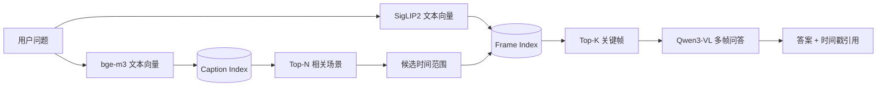
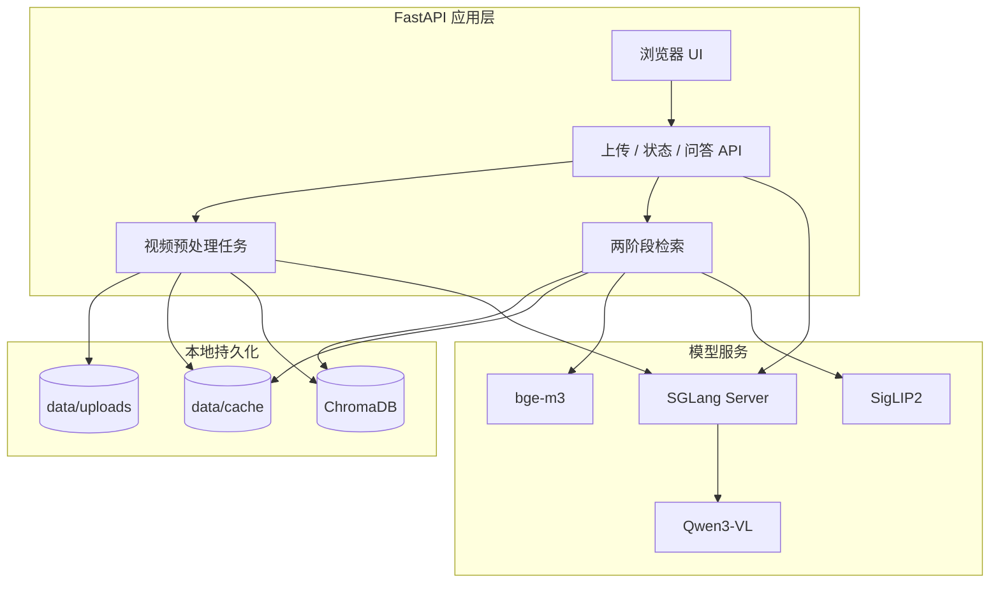
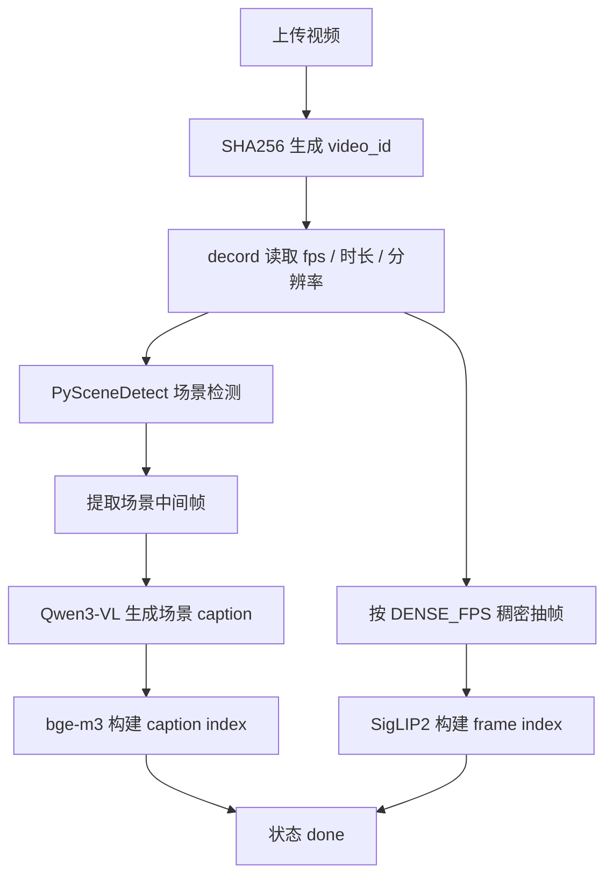
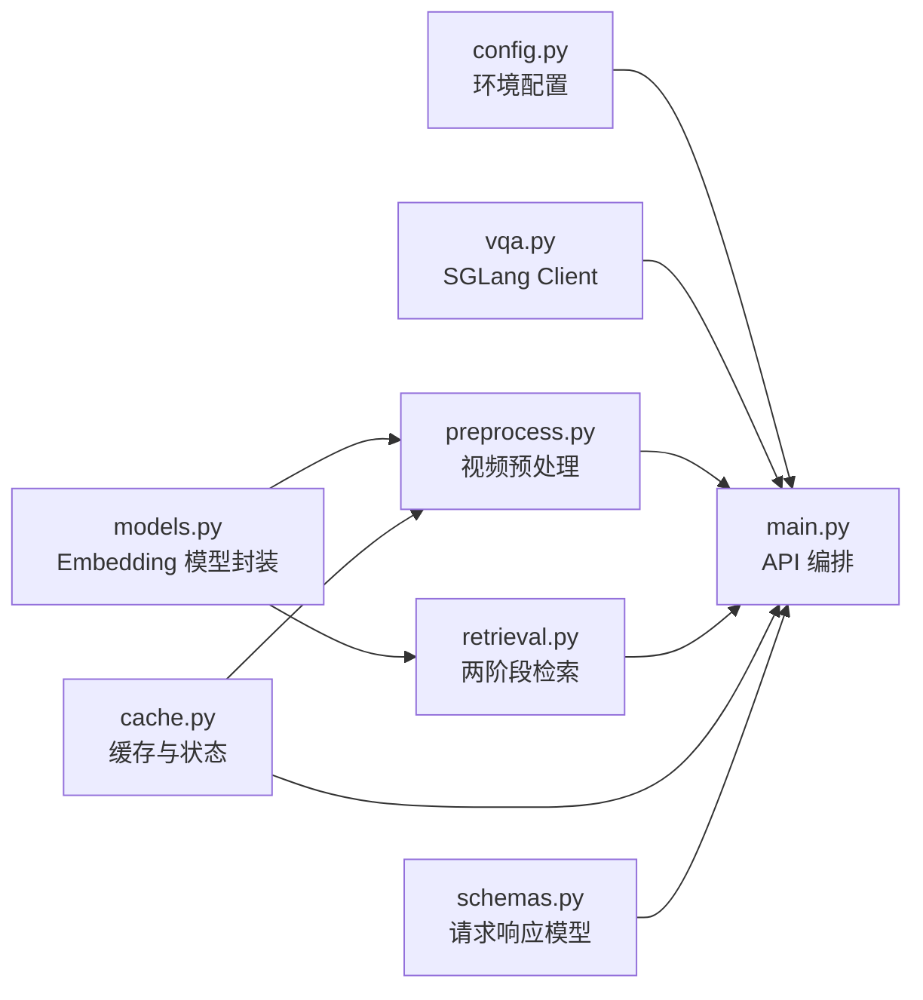

# Mr. Big-Eye

Mr. Big-Eye 是一个面向长视频理解的浏览器端问答系统。用户上传视频后，系统会先离线构建视频索引，再在提问时通过“两阶段检索 + 多模态大模型推理”返回答案和相关关键帧。

当前 Phase 1 MVP 已在 WSL Ubuntu + RTX 4060 Laptop GPU 上跑通，本地推理模型为 `Qwen/Qwen3-VL-2B-Instruct`。服务器迁移时可切换到 `Qwen/Qwen3-VL-8B-Instruct`，并将检索模型改为 GPU 常驻。

## 技术亮点

### 1. 面向长视频的分层检索架构

直接把长视频所有帧塞给 VLM 既不现实，也不稳定：上下文窗口、图像 token、显存、延迟都会迅速失控。Mr. Big-Eye 采用了“先压缩语义，再精排视觉”的两阶段检索方案，把长视频问答拆成可控的工程问题。

第一阶段使用场景检测把视频切成语义片段，并调用 Qwen3-VL 为每个场景中间帧生成 caption。随后使用 bge-m3 将 caption 建成文本向量索引。用户提问时，系统先用问题文本召回最相关的场景片段。

第二阶段在召回到的时间范围内，用 SigLIP2 的图文对齐能力对稠密抽帧进行视觉检索，筛出最相关的 8-12 张关键帧。这样最终交给 Qwen3-VL 的不是冗长视频，而是一组带时间戳的高价值图像证据。



这个设计的核心收益是：

- 将长视频问题转化为小规模多图问答，显著降低 VLM 输入压力。
- 文本 caption 召回负责“语义粗筛”，视觉 embedding 负责“画面精排”，两类信号互补。
- 每个答案都能返回关键帧，便于用户核验模型依据，避免黑盒式回答。
- 索引结果落盘缓存，重复上传相同视频可以复用预处理结果。

### 2. 多模态推理服务与业务服务解耦

项目没有把 Qwen3-VL 直接塞进 FastAPI 进程，而是通过 SGLang 独立启动 OpenAI-compatible 推理服务。业务层只依赖 `SGLANG_ENDPOINT`，通过 `openai.AsyncOpenAI` 调用 `/v1/chat/completions`。

这种架构让推理服务和 Web 服务可以独立伸缩、独立部署、独立调参。迁移服务器时，FastAPI 业务代码不需要感知底层模型从 2B 切换到 8B，也不需要关心 SGLang 的 CUDA graph、attention backend、FlashInfer JIT 等细节。



工程上，这带来了几个很重要的好处：

- 推理模型可以独立由 SGLang 托管，便于利用高性能 serving 框架。
- App 进程只负责业务编排、状态管理、缓存和检索，不直接承担 VLM 显存生命周期。
- 本地开发用 2B 模型，服务器部署用 8B 模型，接口保持一致。
- 可以保留兼容 OpenAI SDK 的调用方式，后续替换推理后端成本低。

### 3. 视频预处理流水线可缓存、可复用、可观测

视频上传后，系统会计算文件 hash 作为 `video_id`，并将预处理产物写入 `data/cache/{video_id}`。缓存目录包含元数据、场景帧、稠密帧、caption JSONL、caption index 和 frame index。这样设计的好处是预处理结果天然可复用，也方便调试每一个阶段。



预处理链路中的关键工程点：

- 使用 `decord` 做视频 probe 和帧读取，避免依赖外部 ffmpeg CLI。
- 使用 `PySceneDetect` 进行内容变化检测；场景过少时自动 fallback 到固定时间切片。
- 场景 caption 存成 `captions.jsonl`，方便离线分析和排错。
- ChromaDB 使用 persistent client，索引随视频缓存持久化。
- 状态由 `running / done / failed:*` 管理，前端可轮询展示进度。
- CPU/GPU 大模型加载有可配置策略，适配 laptop 与 server 两类环境。

### 4. 本地资源受限场景下的工程适配

本项目是在 WSL Ubuntu + RTX 4060 Laptop GPU + 16GB RAM 的约束下完成 MVP 跑通的。这个环境有两个典型限制：GPU 显存只有 8GB，系统内存也不足以同时常驻 Qwen3-VL、bge-m3 和 SigLIP2。

因此项目支持低内存本地运行模式：

```env
LOAD_MODELS_ON_STARTUP=false
UNLOAD_MODELS_AFTER_USE=true
MODELS_DEVICE=cpu
SIGLIP2_DTYPE=float16
```

这套配置会让检索模型按需加载，用完释放；Qwen3-VL 仍由 SGLang 占用 GPU。虽然本地速度不如服务器，但能在笔记本上完整跑通上传、预处理、索引、检索、问答全链路。

同时，服务器配置单独放在 `.env.server.example`，默认关闭低内存模式：

```env
LOAD_MODELS_ON_STARTUP=true
UNLOAD_MODELS_AFTER_USE=false
MODELS_DEVICE=cuda:0
SIGLIP2_DTYPE=auto
```

这意味着低内存模式不是架构限制，而是本地开发策略。服务器上可以让 bge-m3 和 SigLIP2 常驻 GPU，减少重复加载开销。

### 5. 针对中国大陆网络与 WSL CUDA 的落地优化

项目没有只停留在算法 demo，而是把实际落地中经常踩的环境问题做了工程化处理。

模型下载使用 ModelScope，避免 Hugging Face 在中国大陆网络下不稳定。Python 包安装支持 USTC / Aliyun 镜像，CUDA 相关 conda 包使用清华 conda-forge 镜像。

SGLang 在 WSL 中还涉及 FlashInfer JIT 编译问题。项目启动脚本 `scripts/launch_sglang.sh` 会自动处理：

- `CUDA_HOME=$CONDA_PREFIX`
- conda CUDA target include path
- conda CUDA library path
- CUDA driver stub 链接
- WSL/laptop 上更稳的 SGLang 开关

这些处理解决了 `libnuma.so.1`、`nvcc`、`curand.h`、`-lcuda` 等本地运行问题。它们不是算法本身，但非常体现端到端工程能力：模型能不能真正跑起来，往往就差这些细节。

### 6. 面向后续扩展的模块边界

Phase 1 暂时没有实现 LangGraph 记忆、多用户权限、SSE 流式输出和复杂任务编排，但代码边界已经为这些能力留出了位置。



模块职责相对清晰：

- `app/vqa.py`：只负责 Qwen3-VL caption / QA 调用。
- `app/models.py`：只负责 bge-m3 / SigLIP2 加载、编码、释放。
- `app/preprocess.py`：只负责视频到索引的离线构建。
- `app/retrieval.py`：只负责问题到关键帧的检索。
- `app/cache.py`：只负责文件缓存、状态缓存和目录结构。
- `app/main.py`：只负责 API、后台任务和错误处理。

后续如果引入 LangGraph，可以把 `retrieval -> answer_question -> memory update` 封装成 graph node，而不需要重写底层预处理和索引逻辑。

## 当前能力

Phase 1 MVP 已支持：

- 浏览器上传 MP4 视频。
- 视频时长和上传大小限制。
- 后台预处理视频。
- 场景 caption 索引。
- 稠密关键帧视觉索引。
- 提问后召回 8-12 张相关关键帧。
- 使用 Qwen3-VL 基于关键帧回答问题。
- 返回答案、关键帧和场景命中信息。
- 本地 smoke test 端到端验证。

当前本地 smoke test 结果：

```text
video_id=f5008677c4d7e66b status=done
status=done
A yellow box moves across the frame.
frames=12
```

## 快速开始

建议使用 conda 环境：

```bash
conda create -n mbe-mvp python=3.10 -y
conda activate mbe-mvp
```

配置国内 PyPI 源：

```bash
pip config set global.index-url https://mirrors.ustc.edu.cn/pypi/simple
pip config set global.trusted-host mirrors.ustc.edu.cn
```

安装 App 依赖：

```bash
pip install -r requirements.txt
```

复制配置：

```bash
cp .env.example .env
```

本地 16GB laptop 推荐把 `.env` 调整为：

```env
LOAD_MODELS_ON_STARTUP=false
UNLOAD_MODELS_AFTER_USE=true
MODELS_DEVICE=cpu
SIGLIP2_DTYPE=float16
SGLANG_DISABLE_CUDA_GRAPH=true
SGLANG_ATTENTION_BACKEND=triton
SGLANG_DISABLE_OVERLAP_SCHEDULE=true
```

下载模型：

```bash
python scripts/download_models.py
```

安装 SGLang：

```bash
pip install -r requirements-sglang.txt \
  -i https://mirrors.aliyun.com/pypi/simple/ \
  --trusted-host mirrors.aliyun.com \
  --timeout 300 \
  --retries 10
```

安装 WSL + SGLang 所需 CUDA 辅助包：

```bash
conda install -y --override-channels \
  -c https://mirrors.tuna.tsinghua.edu.cn/anaconda/cloud/conda-forge \
  numactl cuda-nvcc libcurand-dev
```

启动 SGLang：

```bash
bash scripts/launch_sglang.sh
```

另开一个终端启动 App：

```bash
conda activate mbe-mvp
bash scripts/launch_app.sh
```

浏览器打开：

```text
http://localhost:8000
```

## Smoke Test

仓库中包含一个生成的短视频：

```text
tests/fixtures/short_clip.mp4
```

启动 SGLang 和 App 后运行：

```bash
python scripts/smoke_test.py \
  --video tests/fixtures/short_clip.mp4 \
  --question "What object moves across the video?"
```

预期输出包含：

```text
status=done
frames=12
```

## 配置说明

关键环境变量：

| 变量 | 作用 | 本地建议 | 服务器建议 |
| --- | --- | --- | --- |
| `VLM_MODEL_NAME` | Qwen3-VL 模型名 | `Qwen/Qwen3-VL-2B-Instruct` | `Qwen/Qwen3-VL-8B-Instruct` |
| `VLM_MODEL_LOCAL_DIR` | 本地 VLM 路径 | `./models/Qwen3-VL-2B-Instruct` | `./models/Qwen3-VL-8B-Instruct` |
| `MODELS_DEVICE` | bge-m3 / SigLIP2 设备 | `cpu` | `cuda:0` |
| `LOAD_MODELS_ON_STARTUP` | App 启动时加载检索模型 | `false` | `true` |
| `UNLOAD_MODELS_AFTER_USE` | 用完释放检索模型 | `true` | `false` |
| `SIGLIP2_DTYPE` | SigLIP2 dtype | `float16` | `auto` |
| `DENSE_FPS` | 稠密抽帧帧率 | `1.0` | `1.0` 或更高 |
| `TOP_K_FRAMES` | 问答关键帧数 | `12` | `12` |

服务器迁移时建议从 `.env.server.example` 开始，而不是复用本地 `.env`。

## 目录结构

```text
.
├── app/
│   ├── main.py          # FastAPI 路由与后台任务
│   ├── config.py        # Pydantic Settings
│   ├── vqa.py           # SGLang / Qwen3-VL client
│   ├── models.py        # bge-m3 / SigLIP2 wrappers
│   ├── preprocess.py    # 视频预处理与索引构建
│   ├── retrieval.py     # 两阶段检索
│   ├── cache.py         # 文件缓存与状态
│   ├── schemas.py       # API schema
│   └── static/          # 浏览器 UI
├── scripts/
│   ├── download_models.py
│   ├── launch_sglang.sh
│   ├── launch_app.sh
│   └── smoke_test.py
├── tests/
│   ├── test_cache.py
│   ├── test_retrieval.py
│   └── fixtures/short_clip.mp4
├── .env.example
├── .env.server.example
├── requirements.txt
└── requirements-sglang.txt
```

运行时目录：

```text
data/
├── uploads/
└── cache/{video_id}/
    ├── meta.json
    ├── frames_scene/
    ├── frames_dense/
    ├── captions.jsonl
    ├── caption_index/
    └── frame_index/
```

`data/` 和 `models/` 默认不提交到 Git。

## 验证结果

当前已完成的验证：

```bash
python -m pytest -q
```

结果：

```text
3 passed, 1 skipped
```

SGLang OpenAI-compatible API 已验证：

```text
GET  /v1/models
POST /v1/chat/completions
```

端到端 smoke test 已验证：

```text
upload -> preprocess -> retrieve -> answer -> keyframes
```

## 已知限制

Phase 1 仍是 MVP，有意没有把范围扩得过大：

- 前端用 polling 查询状态，还没有 SSE / WebSocket。
- 状态管理目前是轻量文件 + 内存状态组合，不是生产级任务队列。
- 没有用户认证和多租户隔离。
- 没有 LangGraph 长期记忆编排，当前仅保留 history 参数入口。
- 本地 laptop 模式下检索模型按需加载，速度不代表服务器表现。
- README 中的 demo 图仍待录制。

## 后续方向

可继续扩展的方向：

- 使用 LangGraph 管理多轮视频问答、用户偏好和长期记忆。
- 引入 Redis / Celery / Dramatiq 等任务队列替代当前后台任务。
- 改造为 SSE 流式回答，前端实时展示推理过程。
- 加入片段级时间轴 UI，点击关键帧跳转到视频时间点。
- 在服务器上使用 Qwen3-VL-8B-Instruct，并让 bge-m3 / SigLIP2 常驻 GPU。
- 对 caption index 和 frame index 增加版本号，支持模型升级后的缓存失效。

## Demo

待补充：

```text
docs/demo.gif
```
