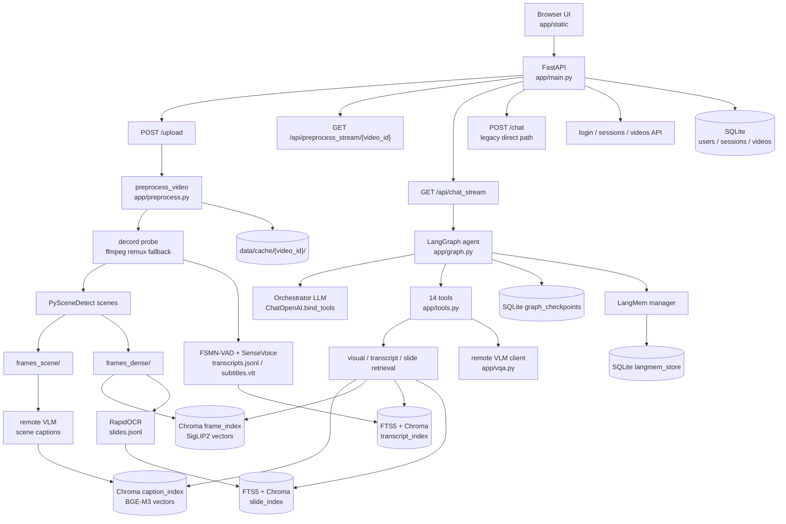
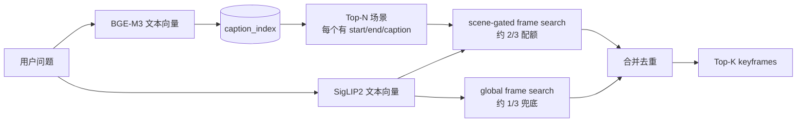
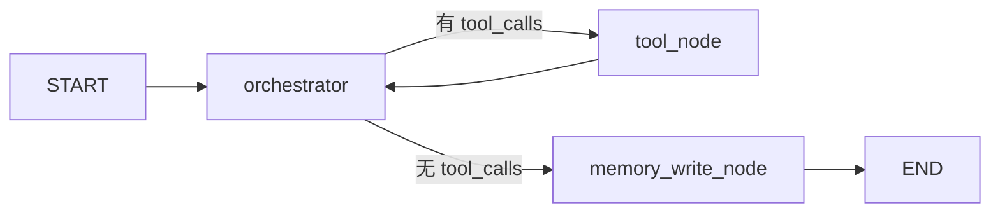

# Mr. Big-Eye

面向长视频理解的浏览器端音画问答系统。

一句话说：**先离线把视频拆成可检索的证据库，再在线让一个 LangGraph agent 按需查证、观察、对齐、回答，并把答案绑定到具体帧、字幕或 PPT/OCR 引用上。**

这个项目不是“把整段视频直接塞给一个大模型”。长视频太长、太贵，也容易丢细节。Mr. Big-Eye 的做法更像一个小型取证系统：

1. 上传视频后，先把视频压缩成多种索引：场景 caption、稠密关键帧、语音转写、PPT/OCR 文本。
2. 用户提问时，agent 先判断问题需要哪种证据：画面、语音、PPT、还是音画联合。
3. agent 调工具检索证据，必要时让 Observer 子模块盯住某个短窗口或多个时刻做细看。 
4. 最终只允许 `answer_with_evidence` 生成面向用户的回答，再由 `verify_grounding` 校验引用。
5. 前端把 `[FRAME:t=...]`、`[TRANSCRIPT:t=...]`、`[SLIDE:t=...]` 渲染成可查看的证据。

如果你已经熟悉 VLM / Agent 的基本概念，但不熟 LangGraph、Chroma、BGE、SigLIP、ASR/OCR 这些具体技术栈，可以把这份 README 当成项目导览和术语翻译表。

---

## 当前实现状态

当前代码库已经从早期“纯视觉 VQA”升级成了 **视觉 + 语音 + PPT/OCR** 的音画 QA 系统。

| 维度 | 当前实现 |
| --- | --- |
| Web 应用 | FastAPI + 原生浏览器 UI，支持上传、预处理进度、会话列表、SSE 流式回答 |
| 视频预处理 | decord probe + ffmpeg remux 兜底、PySceneDetect 切场景、稠密抽帧 |
| 视觉索引 | VLM 生成场景 caption，BGE-M3 建 caption 向量索引；SigLIP2 建关键帧图文向量索引 |
| 语音索引 | FunASR：FSMN-VAD 切语音段，SenseVoice-Small 转写，写 `transcripts.jsonl` + VTT 字幕 |
| PPT/OCR 索引 | 从稠密帧检测 slide/whiteboard 候选，RapidOCR 识别，写 `slides.jsonl` |
| 文本检索 | SQLite FTS5 稀疏检索 + BGE-M3 dense 检索 + RRF 融合 |
| 在线 agent | LangGraph 状态机：orchestrator LLM 决策，ToolNode 执行 14 个注册工具；answer 后有 runtime 收束护栏 |
| VLM 推理 | 业务侧不部署本地 VLM；caption、局部观察、最终回答都走远程 OpenAI-compatible / Doubao API |
| 本地模型 | BGE-M3、SigLIP2、SenseVoice-Small、FSMN-VAD、RapidOCR；它们负责索引和检索，不负责最终大模型回答 |
| 引用协议 | `[FRAME:t=12.3]`、`[TRANSCRIPT:t=10.0-14.0]`、`[SLIDE:t=72.0]` |
| 记忆 | LangGraph SQLite checkpointer 保存单会话状态；LangMem SQLite store 保存跨会话用户记忆 |
| 评测 | `app.eval_harness` 支持 `audiovisual` 数据集；v22 n=50 smoke 为 `45/50 = 0.90` |
| Agent 版本 | `AGENT_CODE_VERSION = "v22"`，见 `app/eval_fingerprint.py` |

> 注意：旧资料里提到的早期工具数、早期 eval 主线和旧 Agent 版本信息已经过时。当前 `TOOLS` 注册表有 14 个工具，音频、PPT/OCR、MCQ 候选解析、temporal resolver 和 grounding 校验都已经进入主路径。

---

## 给第一次读代码的人：先建立心智模型

### 这不是一个单模型应用

项目里有几类“模型”，职责不同：

| 名称 | 类型 | 跑在哪里 | 用来做什么 |
| --- | --- | --- | --- |
| Orchestrator LLM | 文本模型，支持 tool call | 远程 API | 决定下一步调用哪个工具，相当于 agent 的调度脑 |
| VLM | 视觉语言模型 | 远程 API | 看图片帧、生成 caption、做局部观察、写最终答案 |
| BGE-M3 | 文本向量模型 | 本地 | 把问题、caption、字幕、PPT 文本转成向量，用于语义检索 |
| SigLIP2 | 图文向量模型 | 本地 | 把图片帧和文本问题转成同一空间的向量，用于找关键帧 |
| FSMN-VAD | 语音活动检测 | 本地 | 找出音频里哪些时间段有人说话 |
| SenseVoice-Small | ASR | 本地 | 把语音段转成文字和时间戳 |
| RapidOCR | OCR | 本地 | 识别 PPT、白板、屏幕文字 |

所以，“本地不部署 VLM”不等于“本地没有模型”。本地模型负责把长视频变成可检索证据，远程 VLM 负责真正的多模态理解和生成。

### Agent 不等于 VLM

在这个项目里：

- **VLM**：被动接收若干帧和文本证据，然后产出 caption、观察或答案。
- **Agent**：主动决定“先查什么、证据够不够、要不要扩窗、最后怎么校验”。

Agent 的控制逻辑在 `app/graph.py` 和 `app/tools.py`，VLM API 封装在 `app/vqa.py`。

### RAG 在这里是什么意思

RAG 通常是“检索增强生成”。这里的“检索”不是只搜文本，而是搜四类证据：

1. 场景 caption：适合先粗定位视频大段落。
2. 稠密关键帧：适合找画面细节、动作、物体。
3. 语音转写：适合课堂、访谈、解说、对白。
4. PPT/OCR 文本：适合公式、标题、图表标签、屏幕文字。

最终答案必须从这些证据里来，不能直接用模型常识乱答视频内容。

---

## 总体架构



---

## 请求链路：从上传到回答

### 1. 上传视频

前端选择视频后，请求 `POST /upload`。后端逻辑在 `app/main.py`：

1. 按块读取上传文件，计算 SHA256。
2. 取 digest 前 16 位作为 `video_id`。
3. 存到 `data/uploads/{video_id}.mp4`。
4. 用 `probe_video_lenient()` 快速检查时长。
5. 如果缓存已经完成，直接返回 `cached=true`。
6. 如果没缓存，标记状态为 `running`，后台启动 `_run_preprocess()`。

这意味着同一个视频重复上传会复用缓存，不会重新做索引。

### 2. 预处理视频

主入口是 `app/preprocess.py:preprocess_video()`。它把一段视频变成一组离线资产：

```text
data/cache/{video_id}/
├── meta.json
├── .done
├── remuxed.mp4                 # 只有原视频封装异常时才有
├── frames_scene/               # 每个场景的中间帧
├── frames_dense/               # 按 DENSE_FPS 抽出的稠密帧，t0000.0.jpg 这种命名
├── frames_slides/              # 被判定为 PPT/白板候选的帧
├── captions.jsonl              # 每个场景的 VLM caption
├── transcripts.jsonl           # ASR 字幕段
├── subtitles.vtt               # 浏览器字幕文件
├── slides.jsonl                # OCR 结果
├── caption_index/              # Chroma，BGE-M3 caption 向量
├── frame_index/                # Chroma，SigLIP2 图像向量
├── transcript_index/           # Chroma，BGE-M3 字幕块向量
└── slide_index/                # Chroma，BGE-M3 PPT/OCR 块向量
```

预处理阶段包括：

| 阶段 | 做什么 | 主要文件 |
| --- | --- | --- |
| probe | 用 decord 打开视频，读 fps、时长、尺寸；失败时 ffmpeg 无损 remux 后重试 | `app/preprocess.py` |
| scenes | PySceneDetect 按画面变化切场景；场景太少时 fallback 到均匀 10 秒块 | `app/preprocess.py` |
| captions | 每个场景取中间帧，远程 VLM 生成一句 caption | `app/vqa.py` |
| asr | 提取音频，VAD 切段，SenseVoice 转写 | `app/asr.py` |
| caption index | BGE-M3 编码 captions，写 Chroma | `app/preprocess.py` |
| dense frames | 按 `DENSE_FPS` 抽帧，SigLIP2 编码图像，写 Chroma | `app/preprocess.py` |
| slides | 从稠密帧中检测变化明显的候选页，RapidOCR 识别文字 | `app/preprocess.py` |
| text indexes | 字幕和 slide 文本分块，写 FTS5 + BGE dense index | `app/text_assets.py` |

### 3. 用户提问

浏览器端提交问题后走 `GET /api/chat_stream`，它是 SSE 流。后端会：

1. 找到或创建 session。
2. 确认视频预处理状态是 `done`。
3. 修复上次异常中断可能留下的 dangling tool calls。
4. 调用 LangGraph 的 `astream_events()`。
5. 一边接收工具执行结果，一边把证据帧、字幕、答案 token 推给前端。

有一个老接口 `POST /chat`：如果不传 `user_id`，它只做 `two_stage_retrieve + answer_question`，不走完整 agent。真正的主路径是登录会话里的 `/api/chat_stream`。

---

## 离线索引详解

### 视觉索引：先找场景，再找帧

长视频里直接搜每一帧成本高，也容易被局部噪声干扰。项目采用两阶段视觉检索：



关键点是 **配额混合**。如果完全相信 caption 检索出来的场景，那么 BGE-M3 一旦把问题路由到错误场景，后面 SigLIP2 只能在错误时间窗里找帧，整轮就死了。

所以 `app/retrieval.py` 会：

- 先拿 caption index 找 `top_n_scenes`。
- 再在这些场景的时间范围内找约 2/3 的关键帧。
- 如果还没满 `top_k_frames`，再做全局 SigLIP2 检索补足。

这样总帧数不变，VLM token 成本不变，但召回更稳。

### 文本索引：FTS5 + dense + RRF

字幕和 PPT/OCR 不是只用向量搜，也不是只用关键词搜。`app/text_assets.py` 同时建两类索引：

- SQLite FTS5：适合精确词，例如 `REINFORCE`、`A2C`、年份、公式符号。
- BGE-M3 dense index：适合语义问题，例如“老师说 baseline 有什么作用”。

查询时两路各取更多候选，然后用 RRF 合并。RRF 可以理解为“两个排行榜都觉得不错的内容更靠前，但某一路特别强也能保留”。

### Slide/OCR 检测

PPT/OCR 阶段不是对每一帧都 OCR。它先从 `frames_dense/` 中采样，用简单的图像 hash 和灰度差异检测“页面变化明显”的候选帧，再把这些候选复制到 `frames_slides/` 并交给 RapidOCR。

这是一种工程折中：课堂视频里 PPT 通常停留一段时间，没必要每秒 OCR 一次。

---

## LangGraph Agent 架构

### GraphState：agent 的工作台

`GraphState` 是 LangGraph 每轮循环携带的状态，大致长这样：

```python
class GraphState(TypedDict):
    messages: list[AnyMessage]
    video_id: str | None
    user_id: str
    retrieved_frames: list[dict]
    retrieved_scene_hits: list[dict]
    retrieved_transcripts: list[dict]
    retrieved_slides: list[dict]
    retrieval_plan: dict
    timeline: list[dict]
    candidate_timeline: list[dict] | dict
    audiovisual_candidate_matrix: list[dict]
    hypotheses: list[dict]
    evidence_sufficiency: dict
    draft_answer: str
    observer_notes: list[dict]
    grounding_report: dict
    subject_registry: list[dict]
    agent_terminated: str | None
```

这里有两个容易混的点：

1. `messages` 是对话和工具消息历史，用 LangGraph 的 `add_messages` reducer 累加。
2. 其他字段用 `_last_write` reducer，避免一个 orchestrator 同时发多个 tool call 时发生多写冲突。

`retrieved_frames` 里存的是给前端和 VLM 用的 base64 JPEG payload；`retrieved_transcripts` 和 `retrieved_slides` 存的是带时间戳和 marker 的文本证据。`candidate_timeline`、`audiovisual_candidate_matrix` 和 `observer_notes` 是 v21/v22 后新增的结构化中间状态：它们帮助 agent 做时序 MCQ、音画差集和局部观察，但不会被当成最终答案直接输出。

### Graph 节点

`app/graph.py` 编译出的图只有三个主要节点：



- `orchestrator`：调用 `ChatOpenAI(...).bind_tools(TOOLS)`，让模型可以返回 tool calls。
- `tool_node`：LangGraph 的 `ToolNode`，真正执行 `app/tools.py` 里的工具。
- `memory_write_node`：每轮回答结束后，把最近对话交给 LangMem 做长期记忆抽取。

### Orchestrator prompt 的职责

Orchestrator 不是最终回答模型，它的首要职责是规划：

- 先判断问题类型：overview、temporal_order、counting、comparison、visual_detail、text_ocr、existence 等。
- 再选择 retrieval profile：focused、balanced、broad、temporal、detail、negative_check。
- 根据问题决定先调视觉工具、字幕工具、PPT 工具，还是音画对齐工具。
- 如果证据不足，按 `assess_evidence_sufficiency` 的建议补对应模态。
- 一旦证据够用，必须进入 `answer_with_evidence -> verify_grounding -> final`，不能继续做同类检索。

对课堂、讲座、纪录片类视频，prompt 会偏向至少检查一次 transcript 和 slide，避免只看 PPT 漏掉口述内容，或者只看字幕漏掉屏幕上的公式/图表。这个规则只影响证据补全，不会把 agent 固定成单一路径。

---

## 14 个注册工具

当前 `TOOLS` 注册表在 `app/tools.py` 底部，共 14 个工具。`multimodal_vqa` 仍作为 legacy 函数保留，但不在 `TOOLS` 里，不是主路径。

| # | 工具 | 类型 | 作用 | 主要写入状态 |
| :-: | --- | --- | --- | --- |
| 1 | `retrieve_video_evidence` | 视觉检索 | BGE caption 找场景，SigLIP2 找关键帧 | `retrieved_frames`, `retrieved_scene_hits`, `retrieval_plan` |
| 2 | `retrieve_transcript_evidence` | 字幕检索 | 搜 ASR transcript chunks | `retrieved_transcripts` |
| 3 | `search_transcript_keyword` | 精确字幕搜索 | 找精确术语，例如 REINFORCE / A2C | `retrieved_transcripts` |
| 4 | `retrieve_slide_evidence` | PPT/OCR 检索 | 搜 OCR 到的 slide/whiteboard 文本 | `retrieved_slides` |
| 5 | `align_audiovisual_evidence` | 音画对齐 | 给定时间点，取附近帧 + 字幕 + slide；音画差集题会生成候选矩阵 | `retrieved_frames`, `retrieved_transcripts`, `retrieved_slides`, `audiovisual_candidate_matrix` |
| 6 | `build_timeline` | 时序整理 | 把已有 scene/frame/text 证据按时间排序；顺序 MCQ 会生成候选时间线和推荐选项 | `timeline`, `candidate_timeline`, `retrieved_frames` |
| 7 | `retrieve_hypothesis_evidence` | 假设排除 | 针对一个具体假设二次检索，例如“是否戴帽子” | `hypotheses`, `retrieved_frames`, `retrieved_scene_hits` |
| 8 | `segment_focus` | Observer | 围绕一个中心时刻密采短窗口，观察细节 | `retrieved_frames`, `observer_notes`, `subject_registry` |
| 9 | `expand_temporal_evidence` | legacy 扩窗 | 围绕已有时间戳补附近帧；现在更推荐 `segment_focus` | `retrieved_frames` |
| 10 | `stitched_verify` | Observer | 对 2-4 个不连续时间窗做对比观察 | `retrieved_frames`, `observer_notes`, `subject_registry` |
| 11 | `assess_evidence_sufficiency` | 元判断 | 用规则判断证据是否足够；对 temporal、audio-visual、OCR/slide 题检查对应结构化证据 | `evidence_sufficiency` |
| 12 | `answer_with_evidence` | 最终草稿 | 用当前所有视觉/字幕/PPT 证据调用 VLM 写答案；MCQ 必须提交候选项 | `draft_answer`, `grounding_report`, `subject_registry` |
| 13 | `verify_grounding` | 校验 | 检查引用 marker、视觉 claim、否定范围、MCQ 选项一致性和 unsupported brand guess | `grounding_report` |
| 14 | `search_user_memories` | 长期记忆 | 从 LangMem store 搜用户历史偏好/上下文 | 不改 GraphState，只返回 ToolMessage |

工具的返回值都是 LangGraph `Command(update=...)`，所以工具不仅会返回一条 ToolMessage 给 orchestrator，还能直接更新 GraphState。

### v22 结构化推理：MCQ、temporal、audio-visual

v22 的重点不是继续堆 prompt，而是把一些容易让模型“凭感觉选”的问题变成结构化中间结果：

| 结构 | 来自哪里 | 用来解决什么 |
| --- | --- | --- |
| `candidate_timeline` | `build_timeline` + `app/mcq.py` | `(a)(b)(c)` 顺序题、ranking/top-N 题。每个候选事件记录首次时间戳、证据 marker、覆盖状态，并在可判定时给出 `recommended_option`。 |
| `audiovisual_candidate_matrix` | `align_audiovisual_evidence` | “视频里出现但音频没提到”“音频提到但画面没出现”这类差集题。每个候选记录 `visual_seen`、`audio_mentioned` 和对应 marker。 |
| MCQ helper | `app/mcq.py` | 解析 `Candidates:`、识别最终答案选择、检测“选项和解释互相矛盾”。 |

这里有意保持 agenticity：orchestrator 仍然自己选择工具，不走固定 eval path。v22 只在两类位置收束：

- 证据已经被工具结构化后，`answer_with_evidence` 必须服从高置信 `recommended_option`。
- `answer_with_evidence` 已经成功后，runtime 只允许进入 `verify_grounding` 或最终输出，不再继续发散检索。

---

## Retrieval Plan：问题类型和检索 profile

Orchestrator 调 `retrieve_video_evidence` 时可以带两个规划字段：

### question_type

| 类型 | 典型问题 |
| --- | --- |
| `overview` | “总结一下这个视频” |
| `event_location` | “某件事发生在哪里” |
| `temporal_order` | “先发生什么，后发生什么” |
| `counting` | “出现了几次 / 有几个人” |
| `comparison` | “前后有什么变化 / A 和 B 有什么区别” |
| `visual_detail` | “衣服颜色 / 手里拿什么 / 动作细节” |
| `text_ocr` | “屏幕上写了什么 / PPT 公式是什么” |
| `existence` | “有没有某物 / 是否出现过” |
| `general` | 默认兜底 |

### retrieval_profile

| Profile | 默认行为 |
| --- | --- |
| `focused` | 少量场景和帧，适合局部简单细节 |
| `balanced` | 默认 |
| `broad` | 更多场景和帧，适合总结 |
| `temporal` | 更多场景 + 更多帧，适合顺序/计数/比较 |
| `detail` | 帧数翻倍，适合 OCR 或细粒度视觉 |
| `negative_check` | 更大范围扫描；在回答“不存在/没看到”之前使用 |

`_resolve_retrieval_plan()` 会把 planner 给的参数归一化并 clamp 到配置上限，避免模型一口气要求太多证据。

---

## Observer 子模块：为什么需要 segment_focus / stitched_verify

普通检索只会给出若干关键帧。对一些问题，这不够：

- 动作细节需要看一个短窗口里的连续变化。
- “前后变化”需要把两个或多个不连续时刻放在一起对比。
- MCQ 题有时需要排除几个候选，单帧很容易误判。

所以项目加了两个 Observer 工具：

### segment_focus

围绕 `center_t` 取一个短窗口，例如 `[center_t - 4s, center_t + 4s]`。工具层最多加载 12 帧，合并进全局证据池。实际单次 VLM 调用还会受 `VQA_MAX_FRAMES` 限制，默认会均匀抽样最多 6 帧；如果服务端配置把 `VQA_MAX_FRAMES` 调高，就能给 VLM 看更多。

它的 prompt 明确要求：

- 你是 Observer，不是最终回答者。
- 不要选 MCQ 选项。
- 不要写 `The correct answer is X)`。
- 只描述这个窗口里看到的视觉事实。
- 输出写入 `observer_notes`，不会写 `draft_answer`。

### stitched_verify

接受 2-4 个时间窗，例如：

```json
[
  {"start": 15.0, "end": 19.0},
  {"start": 22.0, "end": 26.0}
]
```

它把多个窗口的帧拼起来，交给 VLM 做跨时刻观察。工具层最多加载 24 帧，同样受最终 VLM evidence frame 配置影响。

这两个工具的输出都只是 `observation`。它们会在返回 JSON 里写：

```json
{
  "required_next_action": "answer_with_evidence",
  "note_for_orchestrator": "This is an Observer sub-call's intermediate observation..."
}
```

这是为了防止 orchestrator 把中间观察直接当最终答案。

---

## Subject Registry：视频内主体追踪

长视频里经常会问“刚才那个红衣服的人后来做了什么”。如果每轮都只看当前检索帧，模型容易忘记“那个”是谁。

项目用 `subject_registry` 做单视频内实体登记：

```json
{
  "id": "person_A",
  "label": "红衣男子",
  "first_seen_t": 12.3,
  "last_seen_t": 45.6,
  "attributes": ["持有背包", "在跑步"],
  "evidence_frames": [12.3, 30.1, 45.6]
}
```

实现方式比较巧：VLM prompt 要求在答案末尾追加一行：

```text
SUBJECT_DELTAS: {"deltas": [...]}
```

然后 `parse_subject_deltas()` 把这行 JSON 拿出来，`merge_subject_deltas()` 合并进 registry。这样不需要额外调用一个“记忆更新模型”，成本更低。

注意：`subject_registry` 只属于当前视频对话，存在 LangGraph checkpointer 里，不写入 LangMem。原因很简单：不同视频里的 `person_A` 完全不是同一个人，跨视频复用会污染。

---

## Grounding：引用和校验协议

最终答案里可以出现三类引用：

| Marker | 代表什么 | 例子 |
| --- | --- | --- |
| `[FRAME:t=X.X]` | 某个已检索视频帧 | `[FRAME:t=12.0]` |
| `[TRANSCRIPT:t=A.B-C.D]` | 某段字幕/语音转写 | `[TRANSCRIPT:t=10.0-14.0]` |
| `[SLIDE:t=X.X]` | 某张 PPT/OCR 帧 | `[SLIDE:t=72.0]` |

`verify_grounding` 会检查：

1. `[FRAME:t=...]` 是否靠近已检索帧时间戳。
2. `[TRANSCRIPT:t=...]` 是否匹配已检索字幕证据。
3. `[SLIDE:t=...]` 是否落在已检索 slide/OCR 证据范围内。
4. 视觉 claim 是否带 frame 或 slide 引用。
5. OCR、品牌、logo、屏幕文字、ranking 题是否有 slide/frame 证据，而不是只靠 transcript 或常识。
6. MCQ 最终答案是否选了合法候选项，是否和 deterministic `recommended_option` 冲突。
7. MCQ 解释是否明显否定了开头选择的选项。
8. 否定回答是否先走过 `negative_check`。
9. 否定回答是否限定在“已检查证据中”，而不是武断说“整个视频都没有”。

这套规则不是完美语义验证，但它能拦住很多工程上常见的幻觉：乱编时间戳、说画面事实但不给引用、没做全局扫描就回答“不存在”。

对普通视觉描述里的局部否定，例如“没有看到领带”，不会再自动升级成 whole-video absence 要求；只有原问题本身是 absence/existence/negative-check 类型时，才触发更严格的否定检索约束。

---

## 生产护栏

真实 LLM 很容易出现“语法正确但流程错误”的行为。项目里有 prompt-level 和 runtime-level 两类护栏。

| 护栏 | 类型 | 解决什么问题 |
| --- | --- | --- |
| FINAL ANSWER PROTOCOL | prompt | 禁止把 `segment_focus` / `stitched_verify` 的 observation 直接当最终答案 |
| MCQ HARD RULE | prompt | 多选题必须提交一个选项，不许用“证据不足/无法确定”拒答 |
| transcript/slide 双路检查倾向 | prompt | 讲座/纪录片类问题要兼顾 transcript 和 slide，避免单模态漏证据 |
| 工具调用去重 | runtime | 同一 `(tool, args)` 已经调过就复用结果，避免死循环 |
| tool-call 上限 | runtime | 默认最多 8 次工具调用，到上限就 salvage 或终止 |
| answer 后收束 | runtime | `answer_with_evidence` 成功后强制进入 `verify_grounding` 或 final，禁止继续检索 |
| 证据充足后强制答题 | runtime | `assess_evidence_sufficiency` 通过后直接调用 `answer_with_evidence` |
| cap fallback 强制答题 | runtime | 到工具上限但已有 evidence 时，优先再调用一次 `answer_with_evidence`，MCQ 不允许空 final |
| verify_grounding 停滞检测 | runtime | 连续两次校验同一个答案就短路，避免 verify 循环 |
| 空回复 salvage | runtime | 模型空答时，只从历史 `answer_with_evidence` 或真正 `draft_answer` 抢救草稿，不使用 observer note |
| dangling tool-call 清理 | runtime | 上一轮异常中断后，清掉 checkpoint 里未配对的 tool_call，避免下轮 API 400 |

这些护栏对应的回归测试主要在 `tests/test_graph_orchestrator.py`、`tests/test_tools_planner.py`、`tests/test_vqa.py` 和 `tests/test_main_stream_contract.py`。

---

## VLM 客户端和 Provider 切换

`app/vqa.py` 封装了两种 wire format：

| `VLM_API_FORMAT` | 适用接口 | 请求路径 |
| --- | --- | --- |
| `responses` | Volcano Ark / Doubao Responses API | `{base_url}/responses` |
| `chat_completions` | 大多数 OpenAI-compatible 多模态接口 | `{base_url}/chat/completions` |

业务代码只调用：

- `generate_caption(image)`
- `answer_question(question, frames, timestamps, ...)`
- `stream_answer_question(...)`

至于底层是 Doubao、ModelScope、DashScope、MiMo，主要通过 `.env` 切换。

图片在发送前会：

1. 转 RGB。
2. 按 `VQA_MAX_IMAGE_SIDE` 缩放。
3. 按 `VQA_IMAGE_QUALITY` 编码 JPEG。
4. 变成 base64 data URL。
5. 帧前插入 `[t=X.Xs]` 时间标签。

如果多模态 prompt 超预算，`answer_question()` 会自动降低帧数和图像尺寸重试，最多几轮。

---

## API

| Endpoint | 作用 |
| --- | --- |
| `GET /` | 浏览器 UI |
| `POST /upload` | 上传视频，返回 `video_id` 和预处理 SSE URL |
| `GET /status/{video_id}` | 查询视频预处理状态 |
| `GET /api/preprocess_stream/{video_id}` | SSE 推送预处理阶段进度 |
| `POST /chat` | 兼容/匿名直答；无 `user_id` 时不走完整 agent |
| `GET /api/chat_stream` | 主聊天接口；登录会话 + SSE + 完整 LangGraph agent |
| `POST /api/login` | 本地 name-tag 登录，没有真正认证 |
| `GET /api/sessions` | 当前用户会话列表 |
| `POST /api/sessions` | 创建会话 |
| `PATCH /api/sessions/{session_id}` | 更新会话视频或标题 |
| `GET /api/sessions/{session_id}/messages` | 读取会话历史 |
| `GET /api/videos` | 当前用户已上传/分析的视频 |
| `GET /api/videos/{video_id}/transcripts` | 读取 ASR 字幕段 |
| `GET /api/videos/{video_id}/slides` | 读取 PPT/OCR 结果 |
| `GET /api/videos/{video_id}/subtitles.vtt` | WebVTT 字幕文件 |

---

## 快速开始

### 1. 创建环境

```bash
conda create -n mr-big-eye python=3.10 -y
conda activate mr-big-eye
pip install -r requirements.txt
```

如果使用已有项目环境，请确保 `torch`、`decord`、`chromadb`、`funasr`、`rapidocr_onnxruntime`、`langgraph` 等依赖都装在同一个 Python 环境里。

### 2. 配置 `.env`

```bash
cp .env.example .env
```

至少需要填：

```env
VLM_API_FORMAT=responses
VLM_API_BASE_URL=https://ark.cn-beijing.volces.com/api/v3
VLM_API_KEY=<YOUR_KEY>
VLM_MODEL_NAME=doubao-seed-2-0-pro-260215
```

如果希望 orchestrator 使用另一个更便宜或更擅长 tool call 的文本模型，填：

```env
ORCHESTRATOR_API_BASE_URL=<OPENAI_COMPATIBLE_BASE_URL>
ORCHESTRATOR_API_KEY=<YOUR_KEY>
ORCHESTRATOR_MODEL_NAME=<TOOL_CALL_MODEL>
```

如果这些 `ORCHESTRATOR_*` 留空，orchestrator 会复用 `VLM_API_*`。

### 3. 下载本地检索模型

```bash
python scripts/download_models.py
```

这个脚本下载 BGE-M3 和 SigLIP2。远程 VLM 不会下载到本地。

### 4. 启动应用

```bash
bash scripts/launch_app.sh
```

默认访问：

```text
http://localhost:8000
```

关闭：

```bash
lsof -ti :8000 | xargs -r kill
```

### 5. Smoke test

```bash
python scripts/smoke_test.py \
  --video tests/fixtures/short_clip.mp4 \
  --question "What object moves across the video?"
```

---

## 配置说明

配置由 `app/config.py` 的 Pydantic Settings 读取，默认加载 `.env`。

| 变量 | 作用 |
| --- | --- |
| `VLM_API_PROVIDER` | provider 标签，仅用于记录和分支判断 |
| `VLM_API_FORMAT` | `responses` 或 `chat_completions` |
| `VLM_API_BASE_URL` | VLM API base URL |
| `VLM_API_KEY` | VLM API key |
| `VLM_MODEL_NAME` | caption 和多帧 QA 使用的 VLM |
| `VLM_API_TIMEOUT` | VLM HTTP 超时 |
| `ORCHESTRATOR_API_BASE_URL` | tool-call orchestrator base URL，空则复用 VLM |
| `ORCHESTRATOR_API_KEY` | orchestrator key |
| `ORCHESTRATOR_MODEL_NAME` | orchestrator 模型名 |
| `ORCHESTRATOR_TEMPERATURE` | orchestrator 温度，默认 0.2 |
| `ORCHESTRATOR_MAX_TOOL_CALLS` | 单轮最大工具调用次数，默认 8 |
| `ORCHESTRATOR_STREAMING` | orchestrator 是否流式；默认 false，兼容更多 proxy |
| `MAX_VIDEO_DURATION_SEC` | 上传视频最长时长，默认 600 秒 |
| `MAX_UPLOAD_SIZE_MB` | 上传大小上限 |
| `LOAD_MODELS_ON_STARTUP` | 启动时是否加载本地 BGE/SigLIP |
| `UNLOAD_MODELS_AFTER_USE` | 每次检索后是否释放本地模型，适合低显存机器 |
| `BGE_M3_*` | BGE-M3 模型名和本地目录 |
| `SIGLIP2_*` | SigLIP2 模型名、本地目录、dtype |
| `MODELS_DEVICE` | 本地检索模型设备，例如 `cpu`、`cuda:0`、`auto` |
| `TOP_N_SCENES` | 默认召回多少场景 |
| `TOP_K_FRAMES` | 默认召回多少关键帧 |
| `PLANNER_MAX_TOP_N_SCENES` | planner 可要求的场景上限 |
| `PLANNER_MAX_TOP_K_FRAMES` | planner 可要求的帧上限 |
| `VQA_MAX_FRAMES` | 单次 VLM 调用最多送多少证据帧 |
| `VQA_MAX_IMAGE_SIDE` | VLM 输入图像最长边 |
| `VQA_IMAGE_QUALITY` | VLM 输入 JPEG 质量 |
| `VQA_MAX_OUTPUT_TOKENS` | VLM 答案 token 上限 |
| `SCENE_DETECT_THRESHOLD` | PySceneDetect 内容变化阈值 |
| `DENSE_FPS` | 稠密抽帧帧率 |
| `ENABLE_ASR` | 是否启用 ASR |
| `ASR_LANGUAGE` | ASR 语言，默认 `auto` |
| `ENABLE_SLIDE_OCR` | 是否启用 PPT/OCR |
| `SLIDE_SAMPLE_FPS` | slide 候选采样频率 |
| `SLIDE_CHANGE_HASH_THRESHOLD` | slide 变化检测 hash 阈值 |
| `SLIDE_CHANGE_FRAME_THRESHOLD` | slide 变化检测灰度差阈值 |
| `DATA_DIR` | 运行数据目录 |
| `DATABASE_PATH` | 用户/会话 SQLite 路径，空则用 `data/mr_big_eye.sqlite3` |
| `GRAPH_CHECKPOINT_PATH` | LangGraph checkpoint SQLite 路径 |
| `LANGMEM_STORE_PATH` | LangMem store SQLite 路径 |
| `LANGMEM_*` | LangMem 抽取模型配置，空则复用 VLM |
| `JUDGE_*` | 评测 LLM judge 配置；空时可能 fallback 到 VLM |
| `PROGRESS_LANG` | 预处理进度文案语言，`zh` 或 `en` |
| `LOG_LEVEL` | 日志级别 |

---

## 评测

### 当前推荐：Audiovisual Eval

当前主评测集在 `eval/audiovisual/`，见 `eval/audiovisual/README.md`。它混合了 Video-MME、Perception Test、CinePile、AVQA 等来源，目标是覆盖 visual、audio、joint、overview 几类问题。

运行：

```bash
python -m app.eval_harness \
  --dataset audiovisual \
  --n 50 \
  --prediction-cache data/eval/audiovisual_prediction_cache_v22b.jsonl \
  --output data/eval/audiovisual_report_v22b.json
```

如果不传 `--n`，会跑默认数据集文件中的全部 case。前提是对应视频已经上传/ingest，并且 `get_video_status(video_id) == "done"`。

当前最新可复现实测：

| Run | 样本数 | Pass rate | Answer pass | Agent loop pass | Judge mean |
| --- | ---: | ---: | ---: | ---: | ---: |
| baseline `data/eval/audiovisual_report.json` | 20 | 0.55 | 0.55 | 1.00 | 2.95 |
| v20 `data/eval/audiovisual_report_v20.json` | 20 | 0.70 | 0.75 | 0.95 | 3.00 |
| v21 `data/eval/audiovisual_report_v21.json` | 50 | 0.86 | 0.86 | 1.00 | 3.70 |
| v22b `data/eval/audiovisual_report_v22b.json` | 50 | 0.90 | 0.90 | 0.98 | 4.00 |

v22b 剩余主要失败标签是 citation kind、frame/slide 证据缺失、少量 temporal/factual wrong option。也就是说，当前瓶颈已经从“agent loop 发散或不答题”转向“视觉/OCR 证据召回和引用质量”。

### 预测缓存

评测直接跑 agent 会花费较多 VLM token。`PredictionCache` 用如下信息组成 key：

- case id
- orchestrator model
- VLM model
- prompt fingerprint
- video id
- `AGENT_CODE_VERSION`

所以：

- 改 prompt 会自动换 fingerprint。
- 换 orchestrator 或 VLM 会换 key。
- 改工具集、runtime 行为、状态机逻辑时，需要手动 bump `AGENT_CODE_VERSION`。

当前版本在 `app/eval_fingerprint.py`：

```python
AGENT_CODE_VERSION = "v22"
```

评测结果 JSON 现在还会记录 `failure_tags`、`selected_option`、`recommended_option` 和 `reference_answer`，方便区分 resolver 错、模型没服从 resolver、citation kind 缺失，还是视觉品牌/OCR 证据不足。

### LLM judge 与 Soft-Waive

`app.eval_harness` 保留了可选 LLM judge：

- 如果配置了 `JUDGE_API_KEY`，用独立 judge。
- 如果没配但有 `VLM_API_KEY`，会 fallback 到 VLM，并打印自评 bias warning。
- 如果都没有，就只走规则指标。

当 judge 判语义正确时，harness 会 soft-waive retrieval / citation / agent-loop 的严格 gate，但会把 `*_soft_waived` 字段留在 JSON 里方便 forensic 分析。换句话说：**结果对就先算过，过程问题保留证据，不让边缘 timestamp tolerance 错杀正确答案。**

### Legacy 评测脚本

仓库仍保留 NExT-GQA、LongVideoBench 等转换和脚本：

- `scripts/eval_prepare_datasets.py`
- `scripts/eval_convert_nextgqa.py`
- `scripts/eval_convert_longvideobench.py`
- `scripts/eval_harness.py`
- `scripts/eval_no_retrieval.py`

这些对回归和历史对照仍有价值，但当前 README 的主叙事以音画 QA 为准。

---

## 目录结构

```text
.
├── app/
│   ├── main.py                 # FastAPI 入口、上传、聊天 SSE、session API
│   ├── config.py               # Pydantic Settings，读取 .env
│   ├── graph.py                # LangGraph agent 状态机、orchestrator prompt、护栏
│   ├── tools.py                # 14 个注册工具和 grounding / planner 逻辑
│   ├── vqa.py                  # 远程 VLM API client、prompt、图片 payload 构造
│   ├── models.py               # BGE-M3 / SigLIP2 本地模型 wrapper
│   ├── preprocess.py           # 视频预处理、抽帧、caption、ASR、OCR、索引构建
│   ├── retrieval.py            # 视觉两阶段检索：caption -> frame
│   ├── text_assets.py          # transcript / slide 持久化、FTS5、dense index、RRF
│   ├── asr.py                  # FSMN-VAD + SenseVoice-Small
│   ├── mcq.py                  # MCQ candidate 解析、temporal option resolver、矛盾检测
│   ├── cache.py                # video_id、cache_dir、status、meta、video profile
│   ├── db.py                   # users / sessions / videos SQLite
│   ├── memory.py               # LangMem store / manager / search / write
│   ├── progress.py             # 预处理 SSE pub/sub
│   ├── eval_harness.py         # 评测指标、judge、prediction cache
│   ├── eval_fingerprint.py     # AGENT_CODE_VERSION + prompt hash
│   ├── schemas.py              # FastAPI/Pydantic schema
│   ├── usernames.py            # 本地随机用户名
│   └── static/
│       ├── index.html
│       ├── style.css
│       └── app.js              # 上传、聊天、citation 渲染
├── scripts/
│   ├── launch_app.sh
│   ├── download_models.py
│   ├── smoke_test.py
│   ├── ingest_videomme.py
│   ├── eval_harness.py
│   ├── eval_no_retrieval.py
│   ├── eval_prepare_datasets.py
│   ├── eval_convert_nextgqa.py
│   ├── eval_convert_longvideobench.py
│   └── build_*_eval.py
├── eval/
│   └── audiovisual/
│       ├── README.md
│       ├── questions.jsonl
│       ├── questions.ready.jsonl
│       └── video_manifest.json
├── tests/
│   ├── test_graph_orchestrator.py
│   ├── test_tools_planner.py
│   ├── test_text_assets.py
│   ├── test_asr.py
│   ├── test_vqa.py
│   ├── test_retrieval.py
│   ├── test_eval_harness.py
│   └── fixtures/
├── docker/
├── paper_references/
├── audio_adaption.md           # 音画升级路线和历史 handoff
├── requirements.txt
├── .env.example
└── .env.server.example
```

运行时目录：

```text
data/
├── uploads/                         # 上传视频，按 content hash 命名
├── cache/{video_id}/                # 每个视频的所有预处理资产和索引
├── mr_big_eye.sqlite3               # users / sessions / videos
├── graph_checkpoints.sqlite3        # LangGraph thread 状态
├── langmem_store.sqlite3            # LangMem user memory
├── transcripts.sqlite3              # FTS5 transcript / slide chunks
└── eval/
    ├── prediction_cache.jsonl
    ├── judge_cache.jsonl
    ├── latest_report.json
    └── runs/
```

`data/`、`models/` 默认不进 Git。

---

## 测试

```bash
python -m pytest -q
```

当前 v22 重点回归集：

```bash
PYTHONPATH=. /home/user/miniconda3/envs/mbe-phase2/bin/python -m pytest \
  tests/test_tools_planner.py \
  tests/test_graph_orchestrator.py \
  tests/test_eval_converters.py \
  tests/test_eval_harness.py \
  tests/test_vqa.py
```

最近一次运行结果：`87 passed, 3 warnings`。

当前测试覆盖的重点：

- DB / cache / username 基础行为
- BGE/SigLIP 检索契约
- VQA payload、prompt 关键规则
- ASR 后处理
- transcript / slide text assets
- LangGraph orchestrator loop 和护栏
- tool planner profile、evidence sufficiency、grounding report
- MCQ candidate parsing、temporal recommended option、answer 后 runtime 收束
- main SSE stream contract
- eval converter、eval harness、prediction cache

---

## 常见坑

### 1. decord 打不开视频

某些 B 站、剪映、抖音导出 MP4 会让 decord probe 报 EOF 或 moov 相关错误。项目会自动尝试：

```bash
ffmpeg -c copy -movflags +faststart
```

重封装到 `data/cache/{video_id}/remuxed.mp4`，不重新编码，通常很快。

### 2. DeepSeek tool call 400

`app/graph.py` 检测到 `api.deepseek.com` 时会自动加：

```python
extra_body={"thinking": {"type": "disabled"}}
```

否则某些 DeepSeek thinking 模式会要求把 `reasoning_content` 继续传回去，多轮 tool call 容易 HTTP 400。

### 3. 回答里没有视频引用

优先确认你走的是 `/api/chat_stream`，而不是匿名 `POST /chat` legacy 路径。再检查：

- 视频状态是否 `done`。
- 问题是否被 `_should_use_video()` 判成闲聊。
- Orchestrator 是否已经触发 `answer_with_evidence` 和 `verify_grounding`。

### 4. 模型换了但评测缓存没失效

换 VLM / orchestrator 理论上会进入 prediction cache key。但如果你改的是工具 runtime 行为、prompt 外的代码、VQA 参数、provider-specific `extra_body`，请手动 bump `AGENT_CODE_VERSION`。

### 5. 低显存机器

可以在 `.env` 里设置：

```env
LOAD_MODELS_ON_STARTUP=false
UNLOAD_MODELS_AFTER_USE=true
MODELS_DEVICE=cpu
```

代价是检索会慢，尤其是 SigLIP2 图像编码和 BGE dense search。

---

## 已知限制

- 本地用户系统只是 name-tag，不是认证系统。
- 预处理是 FastAPI 后台任务，不是生产级任务队列。
- 多模态 VLM 的速度、稳定性、费用完全取决于远程 provider。
- `POST /chat` 匿名路径不是完整 agent，只适合兼容和简单 smoke。
- Grounding 校验是规则型，能抓很多工程错误，但不是完美语义证明。
- caption_index、frame_index、transcript_index、slide_index 没有内建 schema/version 文件；升级索引模型后建议清理对应视频缓存重建。
- `subject_registry` 是启发式 JSON 协议，依赖 VLM 按格式输出，代码会尽量 strip 坏 JSON，但不能保证所有 provider 都稳定。
- `VQA_MAX_FRAMES` 默认较小，细粒度动作问题可能需要调高，同时注意 VLM token/图片预算。

---

## 读代码建议

如果你想快速理解项目，不建议从 README 的旧评测表开始。建议按这个顺序读：

1. `app/main.py`：应用入口，理解上传、session、SSE。
2. `app/preprocess.py`：理解视频如何变成缓存和索引。
3. `app/retrieval.py`：理解视觉两阶段检索。
4. `app/text_assets.py`：理解字幕/PPT 的文本检索。
5. `app/tools.py`：理解 agent 能做什么。
6. `app/graph.py`：理解 agent loop、prompt 和护栏。
7. `app/mcq.py`：理解 MCQ 解析、temporal resolver 和选项矛盾检测。
8. `app/vqa.py`：理解 VLM prompt、图片 payload、citation 协议。
9. `app/static/app.js`：理解前端如何消费 SSE 和渲染引用。
10. `tests/test_graph_orchestrator.py`、`tests/test_tools_planner.py`：看设计意图的最好补充。

---

## English TL;DR

Mr. Big-Eye is a browser-based long-video audiovisual QA system. It preprocesses each uploaded video into searchable visual, transcript, and slide/OCR assets, then uses a LangGraph tool-calling agent to retrieve evidence, inspect short temporal windows, align audio and visuals, draft an evidence-grounded answer, and verify citations before responding.

The local stack runs retrieval/ingest models only: BGE-M3 for text embeddings, SigLIP2 for image-text frame retrieval, SenseVoice/FSMN-VAD for ASR, and RapidOCR for slides. Multimodal reasoning is delegated to a remote VLM API. The online agent currently exposes 14 registered tools, uses v22 structured MCQ/temporal/audio-visual diagnostics, and persists per-session state through a LangGraph SQLite checkpointer plus cross-session user memory through LangMem. The latest audiovisual smoke is 45/50 pass rate on n=50.
