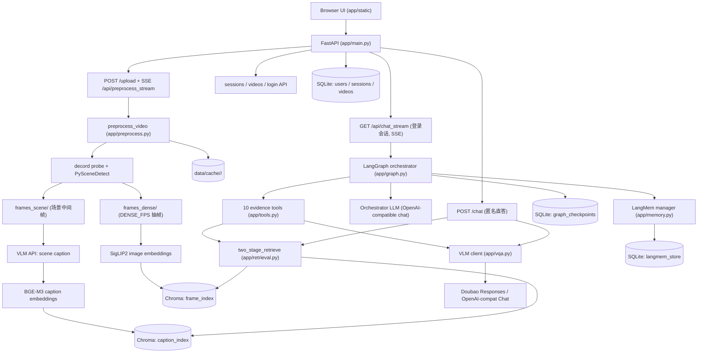
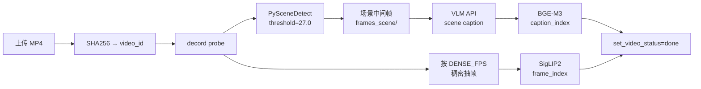
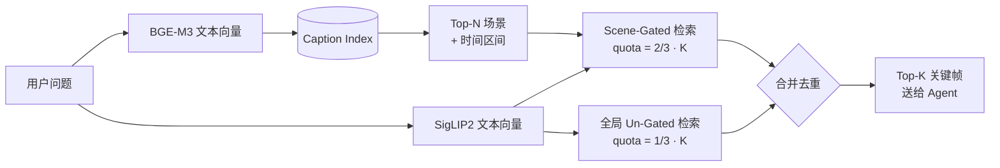
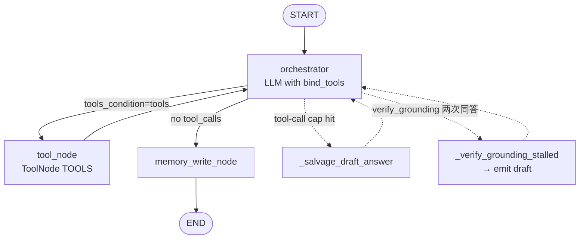
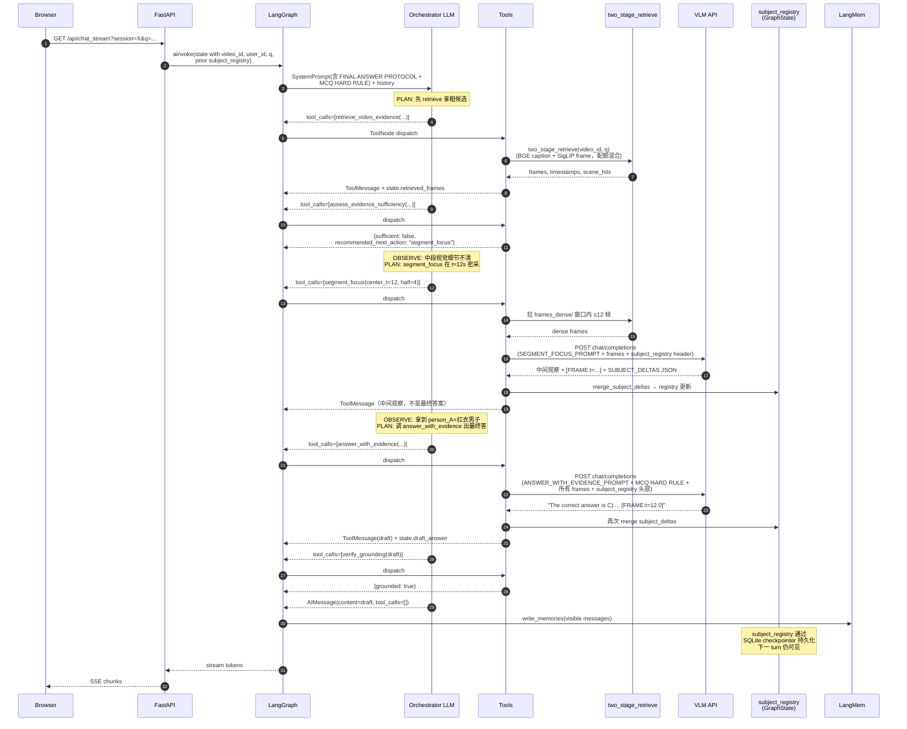

# Mr. Big-Eye

> 面向长视频理解的浏览器端问答系统：离线把视频压成可检索索引，在线由 LangGraph
> agent 规划多步检索 / Observer 子模块探查 / 跨段对比 / 假设排除 / grounding 校验，
> 最终生成带 `[FRAME:t=...]` 引用、严守 MCQ 强制选项规则的回答。业务侧零 VLM
> 权重，VLM 推理全部走云端 OpenAI-Compatible API；本地常驻只有 BGE-M3（文本→
> 场景召回）与 SigLIP2（文本→关键帧精排）两个轻量编码器。

## 核心定位

把"看长视频→回答任意问题"拆成 **预处理 / 检索 / 推理 / 评测** 四条独立可演进的流水线，并且每条流水线都有可量化的指标和可替换的 provider。结果：

| 维度 | 实现 |
| --- | --- |
| 视频压缩 | PySceneDetect 切场景 + decord 稠密抽帧 → 双索引（Caption + Frame） |
| 检索 | BGE-M3 caption→scene 召回 + SigLIP2 frame 精排，**配额混合**抗 BGE 路由失败 |
| 推理 | LangGraph **10 工具** agent loop：query planner → retrieve → assess → Observer 子模块（`segment_focus` / `stitched_verify` / `expand_temporal_evidence` / `build_timeline`）→ `answer_with_evidence` → `verify_grounding` |
| LensWalk-inspired | Observer 子模块严格"非最终回答者"角色 + `subject_registry` 跨 turn 实体追踪 + 嵌入式 `SUBJECT_DELTAS` 协议（单次 VLM 调用拿状态更新，零额外推理开销） |
| 鲁棒性 | 6 道护栏：FINAL ANSWER PROTOCOL（强制走 `answer_with_evidence`）/ MCQ HARD RULE + banned-phrase / 工具调用去重 / verify-stall 短路 / 空回复 salvage / tool-call 上限兜底 |
| 评测 | 规则指标 + LLM judge + **Soft-Waive**（结果对即过，路径对错只留 forensic 字段）；prompt + orchestrator + VLM + code 四维度 fingerprint 自动失效预测缓存 |
| 可重复 | 每次 run 写 `run_meta` 块 + 追加 `runs_index.csv`，VLM/orchestrator 互换可量化对比 |
| 记忆 | LangGraph SQLite checkpointer（thread 级会话状态，含 `subject_registry`） + LangMem SQLite store（user 级长期记忆） |

## NExT-GQA 当前成绩

NExT-GQA 20-case 固定抽样（`--sample 20 --sample-seed 0`，除标注外），按 LensWalk-inspired 改造阶段排序，全部来自 `data/eval/runs_index.csv` 与 `data/eval/runs/*.json`：

| # | 阶段 | VLM | Orchestrator | Code | Sample | Pass | Judge | 备注 |
|:-:|:----|:----|:-------------|:----:|:----:|:----:|:----:|:-----|
| 1 | baseline | Qwen3-VL-30B-A3B | Doubao-Pro | v5 | seed=0 | 14/20 (70%) | 3.45 | LensWalk 改造前 |
| 1' | no-retrieval 控制组 | Qwen3-VL-30B-A3B | *(均匀抽 6 帧 + 单次 VLM)* | v5 | seed=0 | 14/20 (70%) | — | 检索召回 +18% 但 pass 持平 → VLM 视觉识别成瓶颈 |
| 2 | LensWalk v1 | Qwen3-VL-30B-A3B | Doubao-Pro | v7 | seed=0 | **12/20 (60%)** | — | 加 `segment_focus` + `stitched_verify` + Subject Registry；但 LensWalk "证据不足"指令引入 3 个 MCQ 拒答 regression |
| 3 | MCQ commit 修复 | Qwen3-VL-30B-A3B | Doubao-Pro | v8 | seed=1 | 15/19 (~79%)* | — | 加 MCQ 强制选项规则；3 个 regression 全部救回。*1 case quota 卡掉，pro-rated ~15.8/20 |
| 4 | VLM 升级 | Qwen3.5-122B-A10B | Doubao-Pro | v9 | seed=0 | 14/20 (70%) | 3.50 | 平 baseline 但内部 5 救 / 3 跌 churn；新 VLM 拒答倾向更强 |
| 5 | MCQ hardening | Qwen3.5-122B-A10B | Doubao-Pro | v10 | seed=0 | 14/20 (70%) | 3.50 | 加 banned-phrase 列表 + 决策模板；拒答 2 → 1，救回 1 跌回 1 |
| 6 | DeepSeek orchestrator | Qwen3.5-122B-A10B | DeepSeek-v4-flash | v11 | seed=0 | 6/12 (50%)* | 2.58 | *只完成 12/20（quota）。发现 ds-v4-flash **跳过 `answer_with_evidence` 直接 emit segment_focus 输出**：`segment_focus` 调用从 1 → 37，MCQ 规则失效 |
| 7 | Observer 角色防御 | Qwen3.5-122B-A10B | DeepSeek-v4-flash | **v12** | — | **TBD** | — | 加 FINAL ANSWER PROTOCOL + sub-tool prompt 自己拒答 MCQ；等 quota 重置后跑 |

**可读出的核心经验**：

- **Orchestrator 与 VLM 不可独立优化**：v11 → v12 教训证明，**换 orchestrator 时必须重新审视 sub-tool prompt 的角色边界**——doubao 习惯调 `segment_focus` 探查后再 `answer_with_evidence` 出答案，但 DeepSeek-v4-flash 倾向把 sub-tool 输出当最终答案 emit，导致全部 MCQ 规则失效。
- **n=20 噪声很大**：同套 agent (v7) 在 seed=0/seed=1 之间能跑出 60% vs 79%。**单 seed 数字不可靠，需要 multi-seed 聚合**（详见后续方向）。
- **VLM 视觉识别仍是上限**：v9 升级到 Qwen3.5-122B（4× 激活参数）后总分平 baseline，5 个救回 + 3 个跌回，证明大模型解锁了某些 case 同时也带来新的失败模式（更保守 / 倾向拒答）。
- **Soft-Waive 让 judge 主导分数**：`pass_rate ≈ judge_correct_rate`，规则 gate 只在 judge 明显错杀时降权。

---

## 架构总览



---

## 技术深度与亮点

### 1. 两阶段检索 + 配额混合（抗 BGE 路由失败）

#### 1.1 离线索引构建



#### 1.2 在线检索（配额混合是关键）



**配额混合的动机**：BGE caption→scene 是有失败率的（场景文字描述 ≠ 用户语义问题）。如果 frame 检索完全被 BGE 选中的场景时间窗 gate 住，BGE 一旦路由错，整轮就死。代码在 [app/retrieval.py:84-111](app/retrieval.py#L84-L111)：默认把 2/3 配额留给 scene-gated SigLIP（精度），剩下 1/3 留给全局 un-gated SigLIP（召回兜底）。总帧数和 VLM token 成本不变。

#### 1.3 缓存目录契约

```
data/cache/<video_id>/
├── meta.json              # duration / fps / scene 列表
├── frames_scene/          # 场景中间帧
├── frames_dense/          # tNNNN.N.jpg，按 DENSE_FPS
├── captions.jsonl         # 每场景 caption + meta
├── caption_index/         # Chroma persistent
├── frame_index/           # Chroma persistent
└── .done                  # set_video_status 写入
```

`POST /upload` 用 SHA256 算 `video_id`，相同视频复传秒级命中缓存。

---

### 2. LangGraph Agent Loop with 10-Tool Toolbox

#### 2.1 控制流



#### 2.2 工具清单（[app/tools.py](app/tools.py)）

工具按"agent 典型调用顺序"列出，注册在 `TOOLS` 列表（[app/tools.py:894](app/tools.py#L894)）的有 10 个；`multimodal_vqa` 已 deprecated，不在注册列表里。

| # | 工具 | 角色 | 作用 | 状态写入 |
| :-: | --- | --- | --- | --- |
| 1 | `retrieve_video_evidence` | **检索** | 按 question_type + retrieval_profile 调用 [two_stage_retrieve](app/retrieval.py)（BGE caption → SigLIP frame，配额混合），返回 top-K 关键帧 base64 | `retrieved_frames`, `retrieved_scene_hits`, `retrieval_plan` |
| 2 | `assess_evidence_sufficiency` | **元判断** | 用规则启发式判 sufficient/insufficient 并给 `recommended_next_action`（"call segment_focus"/"call retrieve_hypothesis_evidence"/...） | `evidence_sufficiency` |
| 3 | `build_timeline` | **时序综合** | 把已检索帧按时间排序生成简版 timeline（含 caption），供 temporal_order / counting / comparison 类问题参考 | `timeline` |
| 4 | `segment_focus` ⭐ | **Observer 子模块** | 在指定中心时刻 `center_t` 周围密采 ≤12 帧（默认 1 fps），调 VLM 用 `SEGMENT_FOCUS_PROMPT`（**显式声明"非最终回答者"**）描述窗口内视觉细节；同时通过 `SUBJECT_DELTAS` 协议回传实体增量 | `retrieved_frames` 合并新帧、`subject_registry`、`draft_answer`（中间观察，会被后续 `answer_with_evidence` 覆盖） |
| 5 | `expand_temporal_evidence` | **legacy 扩窗** | 围绕给定时间戳列表扩前后窗口；prompt 明确标 "(legacy; prefer segment_focus)"，仅 fallback 用 | `retrieved_frames` 合并新帧 |
| 6 | `stitched_verify` ⭐ | **Observer 子模块（多窗口）** | 接受 2-4 个不连续时间窗（含 LensWalk-style 触发器：题面有 before/after/in between/比较词时优先），从每段密采，总帧数 cap 24；调 VLM 用 `STITCHED_VERIFY_PROMPT` 综合对比；同样通过 `SUBJECT_DELTAS` 回传增量 | `retrieved_frames` 合并新帧、`subject_registry`、`draft_answer`（中间观察） |
| 7 | `retrieve_hypothesis_evidence` | **假设排除** | 针对一个具体视觉 hypothesis（如 "is the man wearing a hat"）做二次定向检索；MCQ 题型在 candidates 互排时常用 | `hypotheses`, `retrieved_frames` 合并 |
| 8 | `answer_with_evidence` | **最终回答** | 用全部已积累的 frames + `subject_registry` + 用户原问题，调 VLM 用 `ANSWER_WITH_EVIDENCE_PROMPT`（= `QA_SYSTEM_PROMPT` + `SUBJECT_DELTA_PROTOCOL`，**应用 MCQ HARD RULE**）产出 draft 答案；带 `[FRAME:t=...]` 引用 | `draft_answer`, `grounding_report`, `subject_registry` |
| 9 | `verify_grounding` | **校验** | 检查 `[FRAME:t=...]` 是否匹配已检索帧、每条视觉论断是否带 citation、否定回答是否走过 `negative_check` profile 且作用域限定在已检查证据 | `grounding_report` |
| 10 | `search_user_memories` | **跨 session 记忆** | 读取 LangMem store 中该 `user_id` 下的偏好/历史 fact，按 query 相似度返 top-K | （无 GraphState 写入，只产生 ToolMessage 文本） |
| — | `multimodal_vqa` | *(legacy)* | 一次性"frames + question → answer" 快捷调用，prompt 明确告诫不优先用 | 不在 `TOOLS`，仅保留 import |

#### 2.3 LensWalk-inspired 改造的核心：Observer 子模块 + Subject Registry

`segment_focus` 和 `stitched_verify` 是从 LensWalk 论文（[paper_references/LensWalk.pdf](paper_references/LensWalk.pdf)）迁移的"密采单段" / "跨段对比"两种 Observer 模式。我们的实现做了 3 个本地化改动：

- **Token 预算适配**：LensWalk 用 GPT-4 级 token 预算，我们桥到 1/3——`segment_focus` cap 12 帧，`stitched_verify` cap 24 帧 + 最多 4 段窗口。
- **Observer 角色硬约束**（[app/vqa.py:70-92](app/vqa.py#L70-L92)）：每个 sub-tool prompt 开头第一段就声明"**你是 Observer 子模块，不是最终回答者**"，明令禁止写 "The correct answer is X)" 这种最终答案格式。这一条配合 [app/graph.py](app/graph.py) 里的 FINAL ANSWER PROTOCOL（见 §3）是双保险。
- **Subject Registry inline 协议**：避免独立的 memory-update LLM 调用（LensWalk 原方案），我们让 Observer prompt 在答案末尾追加一行 `SUBJECT_DELTAS: {"deltas":[...]}` JSON；[app/tools.py:parse_subject_deltas](app/tools.py) 解析并通过 [app/tools.py:merge_subject_deltas](app/tools.py) merge 进 `subject_registry`，pruned 到 15 个最近实体。下一轮 `answer_with_evidence` 调用时，`subject_registry` 会渲染成"【已知主体登记表】..."注入 VLM user message 头部，模型可以用 `person_A` 这类 id 跨 turn 消歧。

为什么 Subject Registry **不** 存进 LangMem：实体是 intra-video 的，跨 session 复用会污染（同 user 看不同视频，"person_A" 概念完全不同）。Subject Registry 只走 LangGraph SQLite checkpointer，scope 是 `thread_id`（= 一个视频对话）。

#### 2.4 7 种 question_type × 6 种 retrieval_profile

Query planner 在 prompt 里强制 orchestrator 先分类、再选 profile。每个 profile 影响 `top_n_scenes` / `top_k_frames` 默认值：

- `focused`：单点细节（top_n=3, top_k=8）
- `balanced`：默认
- `broad`：综述/摘要（top_n=10, top_k=20）
- `temporal`：时序/计数/比较（top_n=8, top_k=18）
- `detail`：高分辨率视觉/OCR（top_k=18）
- `negative_check`：否定回答前的兜底扫荡（top_n=12, top_k=24）

详见 [app/tools.py](app/tools.py) `_profile_defaults` 与 `_resolve_retrieval_plan`。

#### 2.5 GraphState（持久化在 SQLite checkpointer）

```python
class GraphState(TypedDict):
    messages: Annotated[list[AnyMessage], add_messages]
    video_id: str | None
    user_id: str
    retrieved_frames: Annotated[list[dict], _last_write]
    retrieved_scene_hits: Annotated[list[dict], _last_write]
    retrieval_plan: Annotated[dict, _last_write]
    timeline: Annotated[list[dict], _last_write]
    hypotheses: Annotated[list[dict], _last_write]
    evidence_sufficiency: Annotated[dict, _last_write]
    draft_answer: Annotated[str, _last_write]
    grounding_report: Annotated[dict, _last_write]
    subject_registry: Annotated[list[dict], _last_write]  # ⭐ Subject Registry
    agent_terminated: str | None
```

`_last_write` 是自定义 reducer——一轮中如果 orchestrator 并发触发多个改同一字段的工具（LangGraph 多写冲突），保留最新非 None 的值，避免节点报错。

`subject_registry` 每项形如：

```python
{
    "id": "person_A",
    "label": "红衣男子",
    "first_seen_t": 12.3,
    "last_seen_t": 45.6,
    "attributes": ["持有背包", "在跑步"],
    "evidence_frames": [12.3, 30.1, 45.6],
}
```

整个列表通过 LangGraph checkpointer 持久化在 `data/graph_checkpoints.sqlite3`，scope 是 `thread_id`（= 单个视频对话）。跨对话/跨视频不复用，跨 turn 复用。

---

### 3. Orchestrator 鲁棒性护栏（6 道）

实际 production 调用中，LLM 会产生各种"语法上合法但语义死循环 / 跳步 / 拒答"的输出。护栏分两类：**prompt-level**（在 prompt 里写硬规则）和 **runtime-level**（python 代码强制干预）。

| # | 护栏 | 类型 | 触发条件 | 行为 |
| :-: | --- | --- | --- | --- |
| 1 | **FINAL ANSWER PROTOCOL** ⭐ | prompt | orchestrator 想直接 emit `segment_focus` / `stitched_verify` 等 sub-tool 的输出当最终答案 | [_orchestrator_prompt](app/graph.py#L292) 顶部硬规则：最终答案必须由 `answer_with_evidence` 产生 + `verify_grounding` 校验；sub-tool 输出仅作为中间观察。双保险：[SEGMENT_FOCUS_PROMPT](app/vqa.py#L70) / [STITCHED_VERIFY_PROMPT](app/vqa.py#L84) 自己也声明"Observer 子模块，**不是最终回答者**"，明令禁止写 `The correct answer is X)` |
| 2 | **MCQ HARD RULE + banned-phrase** ⭐ | prompt | VLM 在 MCQ 题面前想用 "证据不足/cannot determine/do not show" 等措辞拒答 | [QA_SYSTEM_PROMPT](app/vqa.py#L42) 把 MCQ 规则放在最前面 `═══ MCQ HARD RULE ═══` 区块；列出 12 条 banned phrase（"I cannot determine"/"insufficient evidence"/"证据不足" 等）+ 4 步决策模板（列候选→排除→提交→按 'The correct answer is X) ...' 格式输出）。明确"30%-confident guess > refusing to commit" |
| 3 | **工具调用去重** | runtime | 同一 `(name, args)` 签名在历史里出现过（[_dedup_tool_calls](app/graph.py#L183)） | 合成 `ToolMessage`（用上次缓存内容），不再 fire 真实工具；若全是 dup 且有 draft，直接 emit draft 终止 |
| 4 | **verify_grounding 停滞** | runtime | 倒数两次 `verify_grounding` 返回相同 answer（[_verify_grounding_stalled](app/graph.py#L245)） | 短路出 draft，不再调模型 |
| 5 | **空回复 salvage** | runtime | 模型返回 `tool_calls=[]` 且 `content=""`（[_make_orchestrator](app/graph.py#L82)） | 从历史里捞最长 non-truncated `answer_with_evidence` payload；若仍无，注入 coercion HumanMessage 重试一次 |
| 6 | **Tool-call 上限** | runtime | 一轮工具调用数 ≥ `orchestrator_max_tool_calls`（默认 8） | salvage draft；无 draft 则置 `agent_terminated="cap"` |

每个 runtime 护栏（#3-#6）对应 [tests/test_graph_orchestrator.py](tests/test_graph_orchestrator.py) 里的一个回归测试。prompt 护栏（#1-#2）的核心 invariants 在 [tests/test_vqa.py](tests/test_vqa.py)（`证据不足` 关键词存在）和 [tests/test_graph_orchestrator.py](tests/test_graph_orchestrator.py)（`stitched_verify`/`segment_focus`/`PLAN`/`OBSERVE` 关键词存在）里被守护。

**护栏 #1 的来源**：v11 在 DeepSeek-v4-flash orchestrator 上跑 eval 时发现的真实 failure mode——doubao 习惯调 `segment_focus` 探查后再 `answer_with_evidence`，DeepSeek-v4-flash 倾向把 `segment_focus` 的描述输出当最终答案 emit，导致 `segment_focus` 调用从 ~1 次/case 飙到 37 次，且 MCQ 规则完全失效。v12 加这条护栏修复。

---

### 4. Soft-Waive 评测哲学：结果对就过，路径对错留 forensic

传统 harness：retrieval / answer / agent_loop 三段都 strict gate，AND。问题：LLM judge 已经判答案正确，但 retrieval 召回因 tolerance 边缘 fail（如 ts_dist=2.1s vs tolerance=2.0s），整 case 被错杀。

[app/eval_harness.py:evaluate_case](app/eval_harness.py#L107) 的解法：当 `judge.correct=True` 时，**citation / agent / retrieval** 三个 gate 全部 soft-waive，并在 JSON 里留下 `*_soft_waived: True` 字段供 forensic：

```python
# 简化伪代码
if judge_pass:
    answer["citation_soft_waived"] = not answer["citation_correct"]
    answer["passed"] = hallucination_free and uncertainty_ok
    agent["soft_waived"] = (agent["passed"] is False)
    retrieval["soft_waived"] = (retrieval["passed"] is False)

retrieval_ok = retrieval["passed"] is not False or retrieval["soft_waived"]
agent_ok = agent["passed"] is not False or agent["soft_waived"]
passed = retrieval_ok and answer["passed"] and agent_ok
```

效果：当前 NExT-GQA 20-case run 的 `pass_rate == judge_correct_rate == 0.70`，三个 strict gate 在严格统计里仍可读（`agent_loop_pass_rate=0.65, retrieval_pass_rate=0.75`），但不会拖累 outcome 分。

---

### 5. Prediction Cache + 四维度 Fingerprint

跑 harness 时直接调本地 agent 是 token-密集型操作。Cache key 由两层组成：

```python
# Layer 1: prompt fingerprint (app/eval_fingerprint.py)
prompt_fp = sha1(QA_SYSTEM_PROMPT ‖ _orchestrator_prompt(has_video=True) ‖
                 _orchestrator_prompt(has_video=False) ‖ AGENT_CODE_VERSION)[:12]

# Layer 2: full cache key (app/eval_harness.py:PredictionCache.make_key)
key = sha1(case_id ‖ f"{orchestrator}|vlm={vlm}" ‖ prompt_fp ‖
           video_id ‖ AGENT_CODE_VERSION)
```

四维度自动失效规则：

- **改 prompt**：fingerprint 自动变，受影响的缓存条目失效，未变的继续命中。
- **改 orchestrator 模型**（doubao → ds-v4-flash）：`f"{orchestrator}|..."` 段变，key 变，cache miss → 重跑。
- **改 VLM 模型**（Qwen3-VL-30B → Qwen3.5-122B）：`vlm={vlm}` 段变，key 变，cache miss → 重跑。
- **改 agent 运行时行为**（dedup 逻辑、新加护栏、改 `extra_body` 等不动 prompt 文本的改动）：必须**手动** bump `AGENT_CODE_VERSION`（当前 **`v12`**），否则历史 cache 仍命中导致结果污染。
- **改打分逻辑**（如 Phase B 的 soft citation gate）：完全不动 prediction，只在已有缓存上重算指标，秒级出报告。

> **⚠️ 历史坑**：早期 fingerprint **只**含 prompts + version，不含 model name。改 VLM 而不 bump version 会沉默命中旧模型 prediction。已修：`make_key` 在 [app/eval_harness.py:222-226](app/eval_harness.py#L222-L226) 把 orchestrator + VLM model name 都打进 key 第二段（"compose both orchestrator and VLM into the cache key so swapping either one invalidates affected entries"）。但**改 model 时仍建议 bump version 双保险**，因为 `extra_body` 等其他 model-specific 参数不在 key 里。

`data/eval/prediction_cache.jsonl` 是 append-only JSONL（同 `JudgeCache` 模式）。

---

### 6. 多 Provider VLM + Run-Level Footprint

#### 6.1 两种 wire format 自动切换

[app/vqa.py](app/vqa.py) 封装：

- `responses`：火山方舟 Doubao `POST /responses`，input 是 `[{role, content:[{type:input_image|input_text}]}]`
- `chat_completions`：OpenAI-compatible（ModelScope / 小米 MiMo / Volcengine /...），messages 是 `[{role, content:[{type:image_url|text}]}]`

切换只动 `.env`，业务零改动。

#### 6.2 每次 run 留可对比指纹

`scripts/eval_harness.py` 在每次 run 时往输出 JSON 写 `run_meta` 块，并 append 一行到 `data/eval/runs_index.csv`：

```
timestamp,vlm_model,orch_model,fingerprint,version,n,seed,pass_rate,
answer_pass_rate,judge_correct_rate,recall_mean,ts_dist_mean,output_path
```

VLM swap 体验：换 provider → 跑一次 → `column -t -s, data/eval/runs_index.csv` 直接对比。本 README 顶部的成绩表就是这个 CSV 导出的。

---

### 7. Grounding + Negative-Answer Protocol

回答里写 `[FRAME:t=29.7]` 这类 marker，前端把 marker 替换成内联缩略图。`verify_grounding` 工具做四件事：

1. marker 是否落在已检索帧附近（容忍 tolerance）。
2. visual claim 是否带 citation（如"红衣男子在跑步"但没引用任何帧）。
3. 否定回答（"没有/不存在/未看到/没看到"）是否先调用过 `negative_check` profile 检索。
4. 否定回答是否把作用域限定在"已检查证据/当前关键帧"而非全视频（防止过度泛化否定）。

效果：模型倾向回答"在已检查的关键帧中没有看到 X"而不是直接"视频中没有 X"。

---

### 8. 双层记忆系统

| 层 | 后端 | 作用域 | 内容 |
| --- | --- | --- | --- |
| LangGraph Checkpointer | `data/graph_checkpoints.sqlite3` | thread_id（一个对话 = 一个视频） | 完整 `GraphState`，支持断线重连/历史回看 |
| LangMem | `data/langmem_store.sqlite3` | user_id | 用户偏好、跨 session 的语义事实 |

[app/graph.py:_make_memory_write_node](app/graph.py#L377) 在每轮回答后，把最近 12 条可见消息送给 LangMem manager 抽取并 upsert。orchestrator 通过 `search_user_memories` 工具主动检索。两层互不串扰——视频内的临时实体不会污染跨 session 的 user memory。

---

### 9. 控制组：无检索基线

[scripts/eval_no_retrieval.py](scripts/eval_no_retrieval.py) 提供一个"均匀抽 N 帧 + 一次 VLM 调用"的 control group，输出 prediction JSONL 可直接喂回 `eval_harness.py --predictions`：

```bash
# 1. 跑控制组生成预测
python scripts/eval_no_retrieval.py \
    --cases tests/fixtures/eval_cases_nextgqa.jsonl \
    --output data/eval/preds_no_retrieval_$(date +%Y%m%d_%H%M).jsonl \
    --num-frames 6 --sample 20 --sample-seed 0

# 2. 用同一 harness 评分
python scripts/eval_harness.py \
    --cases tests/fixtures/eval_cases_nextgqa.jsonl \
    --predictions data/eval/preds_no_retrieval_*.jsonl \
    --output data/eval/runs/nextgqa_$(date +%Y%m%d_%H%M)_no_retrieval.json \
    --judge
```

意义：成绩表第 6 行表明在当前 20-case 样本上，**两阶段检索把召回从 0.675 抬到 0.800**（+18%），但 pass_rate 都是 0.70——VLM 视觉识别已经成了瓶颈。下一步收益不在 retrieval，在 [paper_reference_plan.md](paper_references/paper_reference_plan.md) 里的 multi-segment Observer 工具。

---

## 完整请求流程（提问到回答）



**6 道护栏随时可能介入提前 emit**：FINAL ANSWER PROTOCOL（禁止把 sub-tool 输出当最终答案）、MCQ HARD RULE（禁止对 MCQ 拒答）、dedup（同 args 工具调用）、verify-stall（两次同答短路）、salvage（空回复捞 draft）、cap（≥8 工具调用强制收尾）。

---

## 快速开始

### 环境

```bash
conda create -n mr-big-eye python=3.10 -y
conda activate mr-big-eye

# 可选：国内 PyPI 源
pip config set global.index-url https://mirrors.ustc.edu.cn/pypi/simple

pip install -r requirements.txt
```

### 配置

```bash
cp .env.example .env
# 填 VLM_API_KEY / ORCHESTRATOR_API_KEY，详见 .env.example
```

**当前推荐配置**（ModelScope VLM + DeepSeek 官方 API orchestrator）：

```env
# VLM (Qwen3.5-122B-A10B，多模态早融合)
VLM_API_PROVIDER=modelscope
VLM_API_FORMAT=chat_completions
VLM_API_BASE_URL=https://api-inference.modelscope.cn/v1
VLM_API_KEY=<MODELSCOPE_KEY>
VLM_MODEL_NAME=Qwen/Qwen3.5-122B-A10B

# Orchestrator (DeepSeek-v4-flash，1元/M 输入，cache hit 0.02元/M)
ORCHESTRATOR_API_BASE_URL=https://api.deepseek.com
ORCHESTRATOR_API_KEY=<DEEPSEEK_KEY>
ORCHESTRATOR_MODEL_NAME=deepseek-v4-flash
ORCHESTRATOR_TEMPERATURE=0.2
ORCHESTRATOR_MAX_TOOL_CALLS=8
```

> **⚠️ DeepSeek 必备**：[app/graph.py:_orchestrator_model](app/graph.py#L270) 在检测到 `api.deepseek.com` 时自动注入 `extra_body={"thinking": {"type": "disabled"}}`。不关 thinking 模式的话，multi-turn tool call 会触发 HTTP 400 (`reasoning_content must be passed back`)。

**备选 1**：ModelScope VLM + Volcengine ARK orchestrator（doubao）：

```env
VLM_API_PROVIDER=modelscope
VLM_API_BASE_URL=https://api-inference.modelscope.cn/v1
VLM_API_KEY=<MODELSCOPE_KEY>
VLM_MODEL_NAME=Qwen/Qwen3.5-122B-A10B

ORCHESTRATOR_API_BASE_URL=https://ark.cn-beijing.volces.com/api/v3/
ORCHESTRATOR_API_KEY=<ARK_KEY>
ORCHESTRATOR_MODEL_NAME=doubao-seed-2-0-pro-260215
```

**备选 2**：火山方舟单独跑 VLM（无独立 orchestrator，VLM 自己当 orchestrator，不推荐）：

```env
VLM_API_FORMAT=responses
VLM_API_BASE_URL=https://ark.cn-beijing.volces.com/api/v3
VLM_API_KEY=<ARK_KEY>
VLM_MODEL_NAME=doubao-seed-2-0-pro-260215
```

### 下载本地检索模型

```bash
python scripts/download_models.py     # BGE-M3 + SigLIP2，从 ModelScope CDN
```

### 启动

```bash
bash scripts/launch_app.sh            # http://localhost:8000
# 关停
lsof -ti :8000 | xargs -r kill
```

### Smoke Test

```bash
python scripts/smoke_test.py \
  --video tests/fixtures/short_clip.mp4 \
  --question "What object moves across the video?"
```

---

## API

| Endpoint | 作用 |
| --- | --- |
| `GET /` | 浏览器 UI |
| `POST /upload` | 上传视频 → 返回 `video_id` 与 SSE 预处理流 URL |
| `GET /status/{video_id}` | 查询预处理状态 |
| `GET /api/preprocess_stream/{video_id}` | SSE：预处理阶段进度 |
| `POST /chat` | 匿名直答（direct retrieval + VQA，不走 agent） |
| `GET /api/chat_stream` | 登录会话 SSE：走完整 LangGraph agent loop |
| `POST /api/login` | 本地 name-tag 登录 |
| `GET/POST/PATCH /api/sessions[/...]` | 会话 CRUD + 历史消息 |
| `GET /api/videos` | 用户已分析的视频列表 |

---

## 评测管线

### 数据集准备（NExT-GQA only；LongVideoBench 已 descope）

```bash
# 1. 拉数据 + 采样到 20 题
python scripts/eval_prepare_datasets.py --datasets nextgqa --sample 20

# 2. 转 EvalCase JSONL
python scripts/eval_convert_nextgqa.py \
  --raw data/eval/_raw/nextgqa \
  --output tests/fixtures/eval_cases_nextgqa.jsonl

# 3. 拉视频 + 走完整 preprocess 写缓存
python scripts/eval_ingest_videos.py \
  --cases tests/fixtures/eval_cases_nextgqa.jsonl
```

### 跑评测

```bash
# 直接调本地 agent（默认）
python scripts/eval_harness.py \
  --cases tests/fixtures/eval_cases_nextgqa.jsonl \
  --sample 20 --sample-seed 0 --judge \
  --prediction-cache data/eval/prediction_cache.jsonl \
  --output data/eval/runs/nextgqa_$(date +%Y%m%d_%H%M).json

# 用离线 prediction JSONL（控制组 / 其他系统对比）
python scripts/eval_harness.py \
  --cases tests/fixtures/eval_cases_nextgqa.jsonl \
  --predictions some_predictions.jsonl \
  --output data/eval/runs/<name>.json --judge
```

### Judge

`.env` 里 `JUDGE_API_KEY` 留空时，harness 会要求显式 `--no-judge` 或回退到 `VLM_API_*`（带"自评 bias" 警告）。建议生产路径填一个独立 judge：

```env
JUDGE_API_BASE_URL=https://ark.cn-beijing.volces.com/api/v3
JUDGE_API_KEY=<ARK_KEY>
JUDGE_MODEL_NAME=doubao-seed-2-0-pro-260215
```

Judge 结果写入 `data/eval/judge_cache.jsonl`（key=case_id+judge_model+prompt_hash），改打分逻辑时无需重跑 VLM。

### 解读 run 报告

每次 `eval_harness.py` 输出：

- `data/eval/runs/<name>.json`：`run_meta` + `summary` + per-case `results`。
- `data/eval/runs/<name>.md`：人类可读 markdown 报告。
- `data/eval/runs_index.csv`：追加一行用于跨 run 对比。

---

## 配置

| 变量 | 作用 | 默认/示例 |
| --- | --- | --- |
| `VLM_API_FORMAT` | `responses` / `chat_completions` | `chat_completions` |
| `VLM_API_BASE_URL` | VLM 端点 | `https://api-inference.modelscope.cn/v1` |
| `VLM_API_KEY` | VLM Bearer | 空 |
| `VLM_MODEL_NAME` | caption + 多帧 QA 模型 | `Qwen/Qwen3-VL-30B-A3B-Instruct` |
| `VLM_API_TIMEOUT` | VLM HTTP 超时 | `120` |
| `ORCHESTRATOR_API_BASE_URL` | tool-call orchestrator 端点；空则复用 VLM | 空 |
| `ORCHESTRATOR_API_KEY` | orchestrator key | 空 |
| `ORCHESTRATOR_MODEL_NAME` | orchestrator 模型 | 空 |
| `ORCHESTRATOR_TEMPERATURE` | 默认 `0.2` |
| `ORCHESTRATOR_MAX_TOOL_CALLS` | 单轮工具上限 | `8` |
| `ORCHESTRATOR_STREAMING` | 某些 proxy 不支持工具流式，默认关 | `false` |
| `JUDGE_*` | LLM judge 独立端点，空则回退 VLM | 空 |
| `LANGMEM_*` | LangMem 抽取端点，空则回退 VLM | 空 |
| `LANGMEM_QUERY_LIMIT` | 单次 user memory 检索条数 | `6` |
| `TOP_N_SCENES` / `TOP_K_FRAMES` | 检索默认 | `5` / `12` |
| `PLANNER_MAX_TOP_N_SCENES` / `PLANNER_MAX_TOP_K_FRAMES` | planner 上限 | `12` / `36` |
| `VQA_MAX_FRAMES` | 实际送 VLM 的证据帧上限 | 本地 `6`，服务器 `12` |
| `VQA_MAX_IMAGE_SIDE` / `VQA_IMAGE_QUALITY` | 输入图片预处理 | `448` / `75` |
| `DENSE_FPS` | 稠密抽帧帧率 | `1.0` |
| `SCENE_DETECT_THRESHOLD` | PySceneDetect | `27.0` |
| `MAX_VIDEO_DURATION_SEC` | 最大视频时长 | `600` |
| `MODELS_DEVICE` | 本地 BGE/SigLIP 设备 | `cpu` / `cuda:0` |
| `LOAD_MODELS_ON_STARTUP` | 启动时加载本地编码器 | 本地 `false`，服务器 `true` |
| `DATA_DIR` | 运行数据目录 | `./data` |

服务器迁移见 `.env.server.example`。

---

## 目录结构

```text
.
├── app/
│   ├── main.py             # FastAPI 路由 + SSE + 后台预处理
│   ├── config.py           # Pydantic Settings
│   ├── vqa.py              # VLM API client（responses + chat_completions）
│   ├── models.py           # BGE-M3 / SigLIP2 wrappers + lazy load/release
│   ├── preprocess.py       # 视频预处理 + 索引构建 + set_video_status
│   ├── retrieval.py        # 两阶段检索 + 配额混合
│   ├── graph.py            # LangGraph orchestrator + 4 道护栏
│   ├── tools.py            # 9 工具实现 + planner 解析
│   ├── memory.py           # LangMem manager / store
│   ├── eval_harness.py     # 评测指标 + Soft-Waive + 缓存
│   ├── eval_fingerprint.py # AGENT_CODE_VERSION + prompt fingerprint
│   ├── eval_datasets.py    # 数据集元信息
│   ├── cache.py            # 文件缓存 + .done 状态
│   ├── db.py               # SQLite users/sessions/videos
│   ├── progress.py         # SSE pub/sub
│   ├── schemas.py / usernames.py
│   └── static/             # 浏览器 UI
├── scripts/
│   ├── launch_app.sh
│   ├── download_models.py
│   ├── smoke_test.py
│   ├── eval_harness.py
│   ├── eval_no_retrieval.py        # 控制组：均匀采 N 帧 + VLM
│   ├── eval_convert_nextgqa.py     # NExT-GQA → EvalCase JSONL
│   ├── eval_convert_longvideobench.py  # （legacy，LVB 已 descope）
│   ├── eval_prepare_datasets.py    # 拉数据集 + 采样
│   └── eval_ingest_videos.py       # 跑 preprocess + 绑定 video_id
├── tests/
│   ├── fixtures/
│   │   ├── short_clip.mp4
│   │   ├── eval_cases.jsonl
│   │   ├── eval_cases_nextgqa.jsonl
│   │   ├── eval_cases_nextgqa_smoke.jsonl
│   │   ├── eval_predictions.jsonl
│   │   └── datasets/
│   ├── test_eval_harness.py
│   ├── test_eval_converters.py
│   ├── test_graph_orchestrator.py
│   ├── test_main_stream_contract.py
│   ├── test_tools_planner.py
│   ├── test_retrieval.py
│   ├── test_vqa.py
│   ├── test_cache.py / test_db.py / test_memory.py / test_usernames.py
├── paper_references/
│   ├── LensWalk.pdf                # 下一阶段灵感来源
│   └── paper_reference_plan.md     # LensWalk-inspired 改造计划（5 个 phase）
├── .env.example / .env.server.example
└── requirements.txt
```

运行时目录：

```text
data/
├── uploads/
├── mr_big_eye.sqlite3                  # users/sessions/videos
├── graph_checkpoints.sqlite3           # LangGraph thread 状态
├── langmem_store.sqlite3               # LangMem user memory
├── cache/<video_id>/                   # 见 1.3
└── eval/
    ├── _raw/                           # 原始数据集
    ├── datasets/                       # 处理后样本
    ├── prediction_cache.jsonl          # case_id + fingerprint → prediction
    ├── judge_cache.jsonl               # case_id + judge_model → judge 结果
    ├── runs/<dataset>_<ts>_<tag>.json  # 每次 run 报告
    ├── runs/<dataset>_<ts>_<tag>.md
    └── runs_index.csv                  # 跨 run 对比
```

`data/` 与 `models/` 默认不入 Git。

---

## 测试

```bash
python -m pytest -q
```

当前覆盖：缓存 / DB / 用户名 / VQA payload / 两阶段检索契约 / LangGraph orchestrator 4 道护栏 / 工具 planner profile 映射 / evidence sufficiency / grounding report / Soft-Waive 评分 / 数据集 converter / prediction cache / `main.py` SSE stream contract。

---

## 已知限制

- 用户身份是本地 name-tag，不是认证系统。
- 预处理走 FastAPI 后台任务，不是生产级队列。
- 远程 VLM 延迟 / 并发 / 费用取决于 provider。
- `POST /chat` 匿名路径仍是 direct retrieval + VQA；只有登录 SSE 走完整 agent。
- Grounding 是规则型 + LLM judge 混合；细粒度语义对齐还可继续加强。
- caption_index / frame_index 没有版本号，升级 BGE / SigLIP 模型需手动清缓存。

## 已完成的里程碑

- **LensWalk-inspired agent 升级 (v6-v12)**（计划见 [paper_references/paper_reference_plan.md](paper_references/paper_reference_plan.md)）：
  - ✅ `stitched_verify` 工具：跨多窗口对比，对应 temporal_order / comparison
  - ✅ `segment_focus` 工具：单窗口 1fps 密采，对应 visual_detail
  - ✅ VQA prompt LensWalk-style 严格 scope 约束（防 Evidence Dilution）
  - ✅ Orchestrator THINK→PLAN→OBSERVE 显式声明
  - ✅ Subject Registry：单视频跨 turn 实体追踪（GraphState 字段，per thread_id 持久化，**不**进 LangMem）
  - ✅ MCQ HARD RULE + banned-phrase 列表（v8/v10 两次硬化）
  - ✅ FINAL ANSWER PROTOCOL + Observer 角色防御（v12，修 DeepSeek-v4-flash 跳过 `answer_with_evidence` 问题）

## 后续方向

- **`/eval-multiseed` skill（最高 ROI）**：当前 n=20 的方差天花板太高（同套代码不同 seed 能跑出 60%/79%），prompt hill-climbing 在追噪声。需要 multi-seed 聚合脚本，输出 mean ± stdev + 标注 seed 间 flip 的不稳定 case。
- **Orchestrator-VLM 协调审计**：v11→v12 教训显示换 orchestrator 时 sub-tool prompt 的角色边界必须重审。考虑写一个 `/orchestrator-behavior-check` smoke test：用 ds-v4-flash / doubao / Qwen3 三套 orchestrator 各跑 3-case，统计每个 tool 的调用比例，自动 flag 异常分布。
- **`segment_focus` 采用率监控**：v12 之后期望 `segment_focus` 调用回归 ~1 次/case；若仍频繁，说明 orchestrator prompt 对 sub-tool vs 最终答案的边界仍不够清晰。
- 索引产物加版本号，模型升级自动失效缓存。
- 引入 Redis / Celery 等任务队列替代后台任务。
- 时间轴 UI：点击关键帧跳转视频时间点。

---

## Highlights (English TL;DR)

- Long-video QA via PySceneDetect + BGE-M3 caption retrieval + SigLIP2 frame reranking with **quota-blended fallback** against BGE routing failures.
- Remote VLM API only (Doubao Responses / OpenAI-compat Chat / ModelScope / DeepSeek); zero local VLM serving stack.
- LangGraph agent loop with **10 tools** including LensWalk-inspired Observer sub-modules (`segment_focus` for dense single-window sampling, `stitched_verify` for cross-window comparison) and a `subject_registry` for intra-video entity tracking via embedded `SUBJECT_DELTAS` protocol (no extra LLM call).
- **6 production-grade guards**: FINAL ANSWER PROTOCOL (forces `answer_with_evidence` as the only path to final answer), MCQ HARD RULE + banned-phrase list (forbids "cannot determine"/"insufficient" on multiple-choice questions), tool-call dedup, verify-grounding stall short-circuit, empty-content salvage, tool-call cap.
- **Soft-Waive scoring**: when LLM judge accepts, citation/agent/retrieval gates soft-waive but keep strict signal in JSON for forensics.
- **Four-dimension prediction cache**: SHA1(case_id ‖ orchestrator|vlm ‖ prompts ‖ AGENT_CODE_VERSION); changing orchestrator or VLM auto-invalidates affected entries.
- **Run-level footprint**: per-run `run_meta` + append-only `runs_index.csv` for reproducible VLM/orchestrator comparison.
- Two-layer memory: LangGraph SQLite checkpointer for thread state (incl. `subject_registry`) + LangMem SQLite store for cross-session user memory.
- Reproducible quality harness over NExT-GQA with a no-retrieval control-group baseline.
